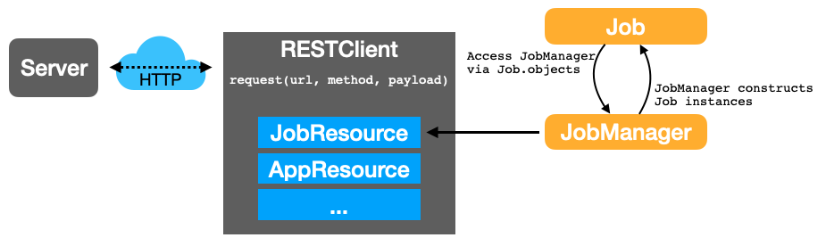

# About the API Client

In transitioning Balsam from a **database-driven** application to a multi-user, **Web
client-driven** application, we have had to rethink how the Python API
should look. Both internal Balsam components and user-written scripts need a way to 
manipulate and synchronize with the central state.

In Balsam `0.x`, users leverage direct access to the Django ORM and manipulate
the database with simple APIs like:
`BalsamJob.objects.filter(state="FAILED").delete()`.
Obviously, direct database access is not acceptable in a multi-user application.
However, in cutting off access to the Django ORM, users would lose the familiar API
(arguably one of Balsams' most important features) and have to drop down to writing
and decoding JSON data for each request.

The client architecure described below provides a solution to this problem with
a *Django ORM-inspired* API.  A familiar Python object model of the data,
complete with models (e.g. `Job`), managers (`Job.objects`), and Querysets
(`Job.objects.filter(state="FAILED").delete()`) is available. Instead of
accessing a database, execution of these "queries" results in a REST API call.

Internally, a `RESTClient` interface encapsulates the HTTP request and authentication logic and
contains `Resource` components that map ordinary Python methods to API methods.

