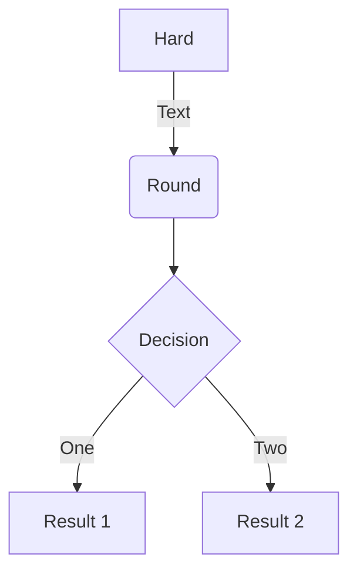

# Developer Guidelines

## Porting to new HPC systems

To port Balsam to a new system, a developer should only need to 
implement the following platform interfaces:

- `platform/app_run`: Add AppRun subclass and list it in the __init__.py
- `platform/compute_node`: Same for ComputeNode
- `platform/scheduler`: Same for SchedulerInterface

Then create a new default configuration folder for the Site under `balsam/config/defaults`.  This isn't strictly necessary (users can write their own config files) but it makes it very convenient for others to quickly spin up a Site with the interfaces you wrote.  

You will need the following inside the default Site configuration directory:

- `apps/__init__.py` (and other default apps therein)
- `settings.yml` (Referencing the platform interfaces added above)
- `job-template.sh`

## Linting

Before commiting any changes to the repository, install the development code into a 
virtual environment and install the **pre-commit** hooks as follows:

```py3
pip install -e .[dev,server,docs]
pre-commit install
```

On commit, code will be auto-formatted with `isort` and `black` and linted with `flake8`.
Linting errors will cause the commit to fail and point to errors.

Contributors may also run the following to re-format, lint, type-check, and test the code:
```bash
$ make format
$ make all
```

## Testing

The Balsam API server can be independently tested:
```bash
$ pytest --cov=balsam/server balsam/server
```

To generate an HTML test-coverage report locally:
```bash
$ coverage html
$ open htmlcov/index.html
```

## Creating diagrams in markdown
Refer to [mermaid.js](https://mermaid-js.github.io/mermaid/#/) for examples on graphs, flowcharts, sequence diagrams, class diagrams, state diagrams, etc...



