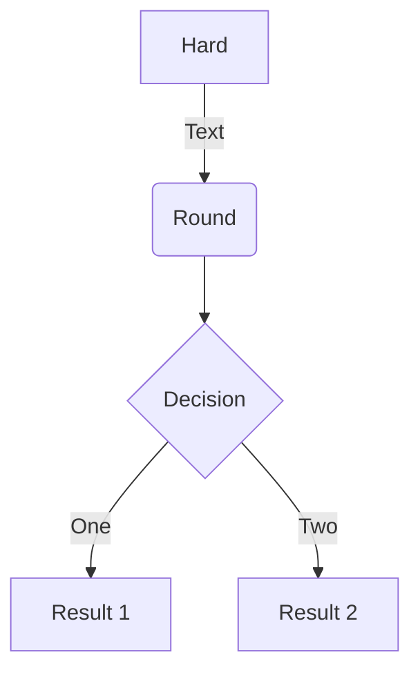

# Contributing to Balsam

## Installing Balsam for Development

For Balsam development and full-stack testing, there are some additional
requirements which are not installed with standard `pip install -e .`
Use `make install-dev` to install Balsam with the necessary dependencies.  Direct server dependencies (e.g. FastAPI) are pinned to help with reproducible deployments.

```
git clone https://github.com/argonne-lcf/balsam.git
cd balsam

# Set up Python3.7+ environment
python3.8 -m venv env
source env/bin/activate

# Install with pinned deployment and dev dependencies:
make install-dev

# Set up pre-commit linting hooks:
pre-commit install
```

## Writing code

Balsam relies on several tools for consistent code formatting, linting, and type checking.  These are automatically run on each `git commit` when the `pre-commit install` has been used to install the pre-commit hooks. 

Otherwise, you should manually perform these actions before pushing new code or making pull requests.  Otherwise, the CI is likely to fail:

```bash
$ make format
$ make lint
$ make mypy
```

If you have made any changes to the Balsam API schemas (in `balsam/schemas/`) or the REST query parameters (in `balsam/server/routers/filters.py`), you must re-generate the client Python library:

```bash
$ make generate-api
```

This runs the `balsam/schemas/api_generator.py` to re-generate the `balsam/_api/models.py` file.  You should not edit this file by hand.

## Testing Locally

To run tests locally, be sure that `BALSAM_TEST_DB_URL` points to an appropriate PostgreSQL testing database (the default value of `postgresql://postgres@localhost:5432/balsam-test` assumes running a DB named `balsam-test` on localhost port 5432 as the `postgres` database user without a password.)

The testing commands rely on `pytest` and can be gleaned from the Makefile.  To run all of the tests, simply use:

```bash
$ make all
```

If you are developing with the Docker container and have a running service, you can simply execute test commands inside the running Balsam web container (named `gunicorn` by default):

```bash
$ docker exec -e BALSAM_LOG_DIR="/balsam/log" \
   -e BALSAM_TEST_API_URL="http://localhost:8000" \ 
   gunicorn make testcov
```

## CI Workflows

Currently, the following processes run in Github Actions whenever code is pushed to `main` or on new pull requests:
1. Build `mkdocs` documentation
2. Run linting, formatting, and `mypy` type checks
3. Run tests against Python3.7, 3.8, and 3.9

Additionally, when new code is pushed or merged to `main`, the official Docker container is rebuilt and published on Docker Hub.  These Github Actions are defined and maintained within the `.github/` directory.

## Viewing and Writing Documentation

To view the docs locally while you edit them, navigate to top-level balsam directory (where `mkdocs.yml` is located) and run:

```bash
$ mkdocs serve
```

Follow the link to the documentation. Docs are markdown files in the `balsam/docs` subdirectory and can be edited 
on-the-fly.  The changes will auto-refresh in the browser window.

You can follow [mermaid.js](https://mermaid-js.github.io/mermaid/#/) examples to create graphs, flowcharts, sequence diagrams, class diagrams, state diagrams, etc... within the Markdown files.  For example:



## Release checklist

1. Start with code in a state that is passing all CI Tests (green checkmark in Github Actions)
2. Double check `make all`: all tests passing locally
3. Update the `__version__` attribute in `balsam/__init__.py`
4. Make a new release commit on the `main` branch with the updated version.
5. Tag the commit: `git tag $VERSION`
6. Push the release commit: `git push`
7. Push the tags: `git push --tags`
8. Update the PyPA `build` and `pip` tools: `pip install --upgrade build pip twine`
9. If it exists, clean up any old distributions: `rm -r dist/`
10. Build the latest Balsam distribution: `python -m build`
11. Check the builds: `python -m twine check dist/*` and ensure both the `.whl` and `.tar.gz` have `PASSED`
12. Publish to PyPI: `python -m twine upload dist/*` (This will require having the PyPI credentials stored locally)