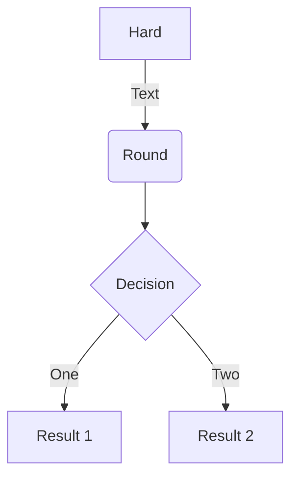
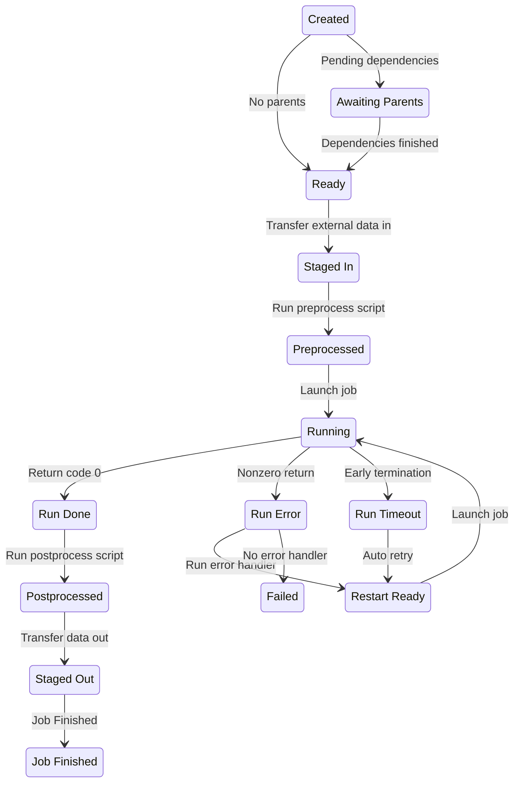

# Developer Guidelines

Before commiting any changes to the repository, install the development code into a 
virtual environment and install the **pre-commit** hooks as follows:

```
pip install -e .[dev,server]
pre-commit install
```

On commit, code will be auto-formatted with `black` and linted with `flake8`.
Linting errors will cause the commit to fail and point to errors.

## Travis CI
- Pre commit: black & flake8
- Run tests, generate coverage report

## ReadTheDocs
- commit hook to build MkDocs

## Testing

Test the DRF backend with PyTest:
```bash
$ pytest --cov=balsam/server balsam/server
```

Generate HTML report locally:
```bash
$ coverage html
$ open htmlcov/index.html
```

## Creating diagrams in markdown
Refer to [mermaid.js](https://mermaid-js.github.io/mermaid/#/) for examples on graphs, flowcharts, sequence diagrams, class diagrams, state diagrams, etc...




