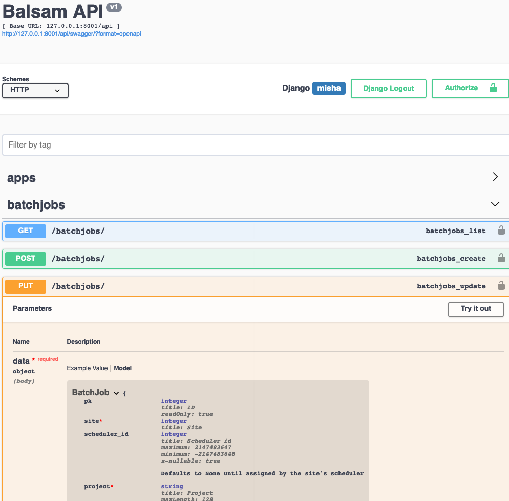
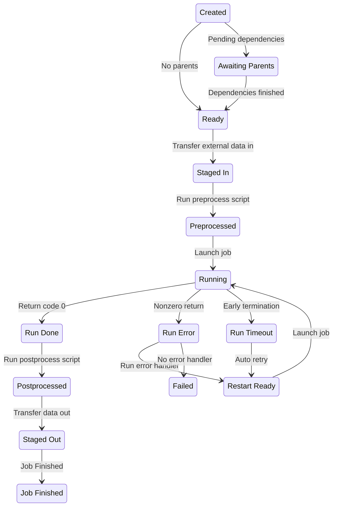
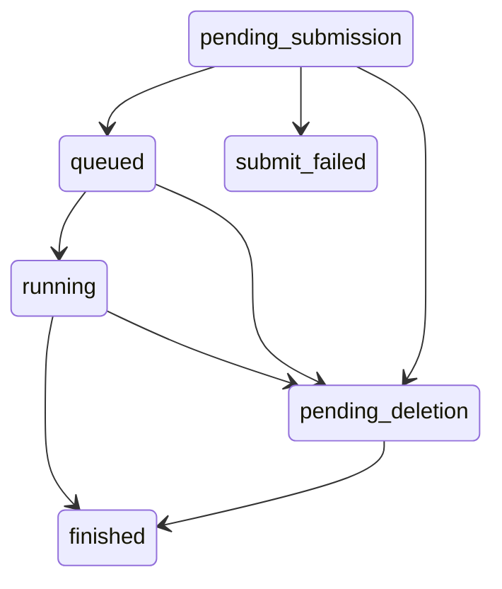

# Data Model and REST API


This graph shows the Django models, or database schema, of the Balsam
application. Each node is a table in the database, represented by one
of the model classes in the Django ORM.
Each arrow represents a ForeignKey 
(or [many-to-one](https://docs.djangoproject.com/en/3.0/topics/db/examples/many_to_one/))
relationship between two tables.

## High-level view of the database

  1. A `User` represents a Balsam user account.  **All** items in the database
     are linked to a single owner, which is reflected in the connectivity of
     the graph. For example, to get all the jobs belonging to `current_user`,
     join the tables via `Job.objects.filter(app__site__user=current_user)`

  2. A `Site` is uniquely identified as a directory on some machine: `(machine
     hostname,  directory path)`. One user can own several Balsam sites
     located across one or several machines.  Each site is an *independent*
     endpoint where applications are registered, data is transferred in and
     out, and Job working directories are located. A Balsam service daemon, which is 
     **authenticated** to the REST API, is uniquely associated with a single `Site` and
     runs as the user on that system. If a user has multiple active Balsam Sites, then a separate
     service runs at each of them.  The authenticated daemon communicates with the central
     Balsam API to fetch jobs, orchestrate the workflow locally, and update the database state. 

  3. An `App` represents a runnable application at a particular Balsam Site.
     Every Balsam Site contains an `apps/` directory with Python modules
     containing `ApplicationDefinition` classes.  The set of
     `ApplicationDefinitions` determines the applications which may run at the
     Site.  An `App` instance in the data model is merely a reference to an
     `ApplicationDefinition` class, uniquely identified by the Site ID and
     class path. 

  4. A `Job` represents a single run of an `App` at a particular `Site`.  The
     `Job` contains both application-specific data (like command line
     arguments) and resource requirements (like number of MPI ranks per node)
     for the run. It is important to note that Job-->App-->Site are
     non-nullable relations, so a `Job` is always bound
     to run at a particular `Site`.  Therefore, the corresponding Balsam service
     daemon may begin staging-in data as soon as a `Job` becomes visible, as appropriate.

  5. A `BatchJob` represents a job launch script and resource request submitted
     by the `Site` to the local workload manager or job Scheduler. Notice that
     the relation of `BatchJob` to `Site` is many-to-one, and that `Job` to
     `BatchJob` is many-to-one. That is, many `Jobs` run in a single
     `BatchJob`, and many `BatchJobs` are submitted at a `Site` over time.

  6. The `Session` is an internal model representing an active Balsam launcher
     session.  `Jobs` have a nullable relationship to `Session`; when it is not
     null, the job is said to be *locked* by a launcher, and no other launcher
     should try running it.  The Balsam **session API** is used by launchers to
     acquire jobs concurrently and without race conditions.  Sessions contain a
     heartbeat timestamp that must be periodically ticked to maintain the session.

   7. A `TransferItem` is created for each stage-in or stage-out task
      associated with a `Job`. This permits the transfer module of the Balsam
      service to group transfers according to the remote source or destination,
      and therefore batch small transfers efficiently. When all the stage-in `TransferItems`
      linked to a `Job` are finished, it is considered "staged-in" and moves ahead to
      preprocessing.

   8. A `LogEvent` contains a `timestamp`, `from_state`, `to_state`, and `message` for each
   state transition linked to a `Job`.  The benefit of breaking a Job's state history out into
   a separate Table is that it becomes easy to query for aggregate throughput, etc... without
   having to first parse and accumulate timestamps nested inside a `Job` field.

## The REST API

The rest of this page details the Django model fields and gives a condensed overview of the API.
Refer to the interactive API documentation for details on URL query parameters and sample
request and response payloads:

```bash
cd balsam/server
./dev/total-reset.sh
./manage.py runserver
# Navigate to 127.0.0.1:8000/api/swagger in browser
```




## User & a note on Auth

The `User` model Extends Django's [default User
model](https://docs.djangoproject.com/en/3.0/ref/contrib/auth/) via
`AbstractUser`. It contains fields like `username` and `email` but is loosely
coupled to the Authentication scheme.

Django REST Framework easily permits swapping Authentication backends or using multiple
authentication schemes.  For every view requiring authentication, 
a `user` object is available on the `request` instance, containing the pre-authenticated
User.

Generally, Balsam will need two types of Auth to function:

1. **Login auth:** This will likely be an pair of views providing an
   OAuth flow, where Balsam redirects the user to an external auth system,
   and upon successful authentication, user information is redirected *back*
   to a Balsam callback view. For testing purposes, basic password-based login
   could be used instead.
2. **Token auth:** After the initial login, Balsam clients need a way to
   authenticate subsequent requests to the API.  This can be performed with
   Token authentication and a secure setup like [Django REST
   Knox](https://github.com/James1345/django-rest-knox).  Upon successful
   *login* authentication (step 1), a Token is generated and stored (encrypted)
   for the User.  This token is returned to the client in the login response.
   The client then stores this token, which has some expiration date, and
   includes it as a HTTP header on every subsequent request to the API (e.g.
   `Authorization: Token 4789ac8372...`). This is both how Javascript web clients and automated Balsam Site services can communicate with the API.


## Site

### Model Fields

| Field Name  | Description |
| -----------  | ----------- |
| `id ` | Unique Site ID | 
| `hostname ` | The server address or hostname like `thetalogin3.theta.alcf.anl.gov` |
| `path ` | Absolute POSIX path to the Site directory |
| `last_refresh ` | Automatically updated timestamp: last update to Site information |
| `creation_date ` | Timestamp when Site was created             |
| `owner ` | ForeignKey to `User` model             |
| `globus_endpoint_id ` | Optional `UUID`: setting an associated endpoint for data transfer |
| `num_nodes`  | Number of compute nodes available at the Site           |
| `num_idle_nodes`  |  Number of currently idle nodes        | 
| `num_busy_nodes`  | Number of currently busy nodes         |
| `backfill_windows`  | JSONField: array of `[queue, num_nodes, wall_time_min]` tuples indicating backfill slots |
| `queued_jobs` | JSONField: array of `[queue, num_nodes, wall_time_min, state]` indicating currently queued and running jobs |
| `optional_batch_job_params` | JSONField used in BatchJob forms/validation `{name: default_value}`. Taken from site config. |
| `allowed_projects` | JSONField used in BatchJob forms/validation: `[ name: str ]` |
| `allowed_queues` | JSONField used in BatchJob forms/validation: `{name: {max_nodes, max_walltime, max_queued}}` |
| `transfer_locations` | JSONField used in Job stage-in/stage-out validation: `{alias: {protocol, netloc}}`

### API

##### Representation
The `owner` field is excluded from the serialized representation.  Created sites
implicitly belong to the authenticated user, and a user can only view or update
sites that belong to them.

##### URLs

| HTTP Method | URL | Description | Example usage |
| ------------| ----- | ---------- | -----   |
| GET | /api/sites/ | Retrieve the current user's list of sites | A user checks their Balsam site statuses on dashboard | 
| POST | /api/sites/ | Create a new Site | `balsam init` creates a Site and stores new `id` locally |
| PUT | /api/sites/{id} | Update Site information | Service daemon syncs `backfill_windows` periodically |
| DELETE | /api/sites/{id} | Delete Site | User deletes their Site with `balsam rm site` |

## App

### Model Fields
| Field Name  | Description |
| -----------  | ----------- |
| `id ` | Unique App ID |
| `site` | Foreign Key to `Site` instance containing this App | 
| `name` | Short name identifying the app. |
| `description` | Text description (useful in generating Web forms) |
| `class_path` | Name of `ApplicationDefinition` class in the format: `{module_name}.{class_name}` |
| `parameters` | Command line template parameters. A dict of dicts with the structure: `{name: {required: bool, default: str, help: str}}` |
| `transfers` | A dict of stage-in/stage-out slots with the structure: `{name: {required: bool, direction: ["in"|"out"], target_path: str, help: str}}` |

The `App` model is used to merely *index* the `ApplicationDefinition` classes
that a user has registered at their Balsam Sites. 

The `parameters` field represents "slots" for each adjustable command line parameter.  
For example, an `ApplicationDefinition` command template of
`"echo hello, {{first_name}}!"` would result in an `App` having the `parameters` list: 
`[ {name: "first_name", required: true, default: "", help: ""} ]`.  None of the Balsam
site components use `App.parameters` internally; the purpose of mirroring this field in 
the database is simply to facilitate Job validation and create App-tailored web forms.

Similarly, `transfers`  mirrors data on the `ApplicationDefinition` for
Job input and validation purposes only.

For security reasons, the
validation of Job input parameters takes place in the site-local `ApplicationDefinition`
module. Even if a malicious user altered the `parameters` field in the API, they would not
be able to successfully run a Job with injected parameters.

### API
##### Representation
A user only sees Apps linked to Sites which belong to them.

##### URLs
| HTTP Method | URL | Description | Example usage |
| ------------| ----- | ---------- | -----   |
| GET | /api/apps/ | Retrieve the current user's list of Apps | `balsam ls apps` shows Apps across sites |
| POST | /api/apps/ | Create a new `App` | `balsam app sync` creates new `Apps` from local `ApplicationDefinitions`  |
| PUT | /api/apps/{id} | Update `App` information | `balsam app sync` updates existing `Apps` with changes from local `ApplicationDefinitions` |
| DELETE | /api/apps/{id} | Delete `App` | User deletes an `App`; all related `Jobs` are deleted |

## Job

### Model Fields
| Field Name  | Description |
| -----------  | ----------- |
| `id ` | Unique Job ID |
| `workdir` | Working directory, *relative* to the Site `data/` directory |
| `tags` | JSON `{str: str}` mappings for tagging and selecting jobs | 
| `session` | ForeignKey to `Session` instance | 
| `app` | ForeignKey to `App` instance | 
| `parameters` | JSON `{paramName: paramValue}` for the `App` command template parameters |
| `batch_job` | ForeignKey to current or most recent `BatchJob` instance in which this `Job` ran |
| `state` | Current state of the `Job` |
| `last_update` | Timestamp of last modification to Job | 
| `data` | Arbitrary JSON data storage |
| `return_code` | Most recent return code of job | 
| `parents` | Non-symmetric ManyToMany  Parent --> Child relations between Jobs |
| `num_nodes` | Number of compute nodes required (> 1 implies MPI usage) |
| `ranks_per_node` | Number of ranks per node (> 1 implies MPI usage) |
| `threads_per_rank` | Number of logical threads per MPI rank |
| `threads_per_core` | Number of logical threads per hardware core | 
| `cpu_affinity` | Flag describing CPU affinity mode | 
| `gpus_per_rank` | Number of GPUs per MPI rank |
| `node_packing_count` | Maximum number of instances that can run on a single node | 
| `wall_time_min` | Lower bound estimate for runtime of the Job (leaving at default 0 is allowed) |


Let workdir uniqueness be the user's problem.  If they put 2
jobs with same workdir, assume it's intentional.  We can
ensure that "stdout" of each job goes into a file named by
Job ID, so multiple runs do not collide.

### State flow


### API
##### Representation
A user can only access Jobs they own. The related App, BatchJob, and parents
are included by ID in the serialized representation. The `session` is excluded
since it is only used internally.   Reverse relationships (one-to-many) with
`transfers` and `events` are also not included in the Job representation, as
they can be accessed through separate API endpoints.

The related entities are represented in JSON as follows:

| Field | Serialized  | Deserialized |
| ----  | ----------  | ------------ |
| `id`  | Primary Key | Fetch Job from user-filtered queryset |
| `app_id`  | Primary Key | Fetch App from user-filtered queryset |
| `batch_job_id`  | Primary Key | Fetch BatchJob from user-filtered queryset |
| `parent_ids` | Primary Key list | Fetch parent jobs from user-filtered queryset |
| `transfers` | **N/A** | *Create only:* Dict of `{transfer_item_name: {location_alias: str, path: str}}`  |
| `events` | **N/A** | **N/A** |
| `session`  | **N/A** | **N/A** |


##### URLs


| HTTP Method | URL | Description | Example usage |
| ------------| ----- | ---------- | -----   |
| GET | /api/jobs/ | Get paginated Job lists, filtered by site, state, tags, BatchJob, or App | `balsam ls` |
| POST | /api/jobs/ | Bulk-create `Jobs` | Create 1k jobs with single API call |
| PUT | /api/jobs/{id} | Update `Job` information | Tweak a single job in web UI |
| DELETE | /api/jobs/{id} | Delete `Job` | Delete a single job in web UI |
| PUT | /api/jobs/ | Bulk-update Jobs: apply same update to all jobs matching query | Restart all jobs at Site X with tag workflow="foo" |
| PATCH | /api/jobs/ | Bulk-update Jobs: apply list of patches job-wise | Balsam StatusUpdater component sends a list of status updates to API |

## BatchJob

### Model Fields
| Field Name  | Description |
| -----------  | ----------- |
| `id ` | Unique ID. Not to be confused with Scheduler ID, which is not necessarily unique across Sites! |
| `site ` | ForeignKey to `Site` where submitted |
| `scheduler_id ` | ID assigned by Site's batch scheduler (null if unassigned) |
| `project ` | Project/allocation to be charged for the job submission |
| `queue ` | Which scheduler queue the batchjob is submitted to |
| `num_nodes` | Number of nodes requested for batchjob |
| `wall_time_min` | Wall time, in minutes, requested |
| `job_mode` | Balsam launcher job mode |
| `filter_tags` | Restrict launcher to run jobs with matching tags. JSONField dict: `{tag_key: tag_val}` |
| `state` | Current status of BatchJob |
| `status_message` | Error or custom message received from scheduler |
| `start_time` | DateTime when BatchJob started running |
| `end_time` | DateTime when BatchJob ended |

### State flow

Every workload manager is different and there are numerous job states
intentionally **not** considered in the `BatchJob` model, including `starting`,
`exiting`, `user_hold`, `dep_hold`, etc.  It is the responsibility of the
site's Scheduler interface to translate real scheduler states to one of the few
coarse-grained Balsam `BatchJob` states: `queued`, `running`, or `finished`.



### API
##### Representation
A user can only see `BatchJobs` belonging to their `Sites`. All fields included in representation.
`Site` represented by `site_id` primary key.

##### URLs


| HTTP Method | URL | Description | Example usage |
| ------------| ----- | ---------- | ----------   |
| GET | /api/batch-jobs/ | Get BatchJobs | Web client lists recent BatchJobs  |
| POST | /api/batch-jobs/ | Create BatchJob | Web client or AutoScaler submits a new BatchJob |
| PUT | /api/batch-jobs/{id} | Alter BatchJob by ID | Web client alters job runtime while queued |
| DELETE | /api/batch-jobs/{id} | Delete BatchJob by ID | User deletes job before it was ever submitted |
| PATCH | /api/batch-jobs/ | Bulk Update batch jobs by patch list | Service syncs BatchJob states |

## Session

### Model Fields
| Field Name  | Description |
| -----------  | ----------- |
| `id ` | Unique ID |
| `heartbeat ` | DateTime of last session tick API call |
| `batch_job` | Non-nullable ForeignKey to `BatchJob` this Session is running under |

### API
##### Representation
A user can only see `Sessions` associated with their `BatchJobs`. The `id` and `batch_job_id`
are represented by their primary keys.

* `Session` creation only requires providing `batch_job_id`. 
* `Session` tick has empty payload
* `Session` **acquire** endpoint uses a special `JobAcquireSerializer` representation:

| Field | Description |
| ----- | ----------  |
| `states`| `list` of states to acquire |
| `max_num_acquire`| limit number of jobs to acquire |
| `filter_tags`| filter `Jobs` for which `job.tags` contains all `{tag_name: tag_value}` pairs |
| `node_resources`| Nested `NodeResource` representation placing resource constraints on what Jobs may be acquired |
| `order_by`| order returned jobs according to a set of Job fields (may include ascending or descending `num_nodes`, `node_packing_count`, `wall_time_min`) |

The nested `NodeResource` representation is provided as a dict with the structure:
```py3
{
    "max_jobs_per_node": 1,  # Determined by Site settings for each Launcher job mode
    "max_wall_time_min": 60,
    "running_job_counts": [0, 1, 0],
    "node_occupancies": [0.0, 1.0, 0.0],
    "idle_cores": [64, 63, 64],
    "idle_gpus": [1, 0, 1],
}
```

##### URLs


| HTTP Method | URL | Description | Example usage |
| ------------| ----- | ---------- | -----   |
| GET | /api/sessions | Get Sessions List | BatchJob Web view shows "Last Heartbeat" for each running |
| POST | /api/sessions | Create new `Session` | Launcher `JobSource` initialized |
| **POST** | /api/sessions/{id}/acquire | **Acquire** Jobs for launcher | `JobSource` acquires new jobs to run |
| PUT | /api/sessions/{id} | Tick `Session` heartbeat | `JobSource` ticks Session periodically |
| DELETE | /api/sessions/{id} | Destroy `Session` and release Jobs | Final `JobSource` `release()` call |

## Transfer

### Model Fields
| Field Name  | Description |
| -----------  | ----------- |
| `id ` | Unique ID |

### API
##### Representation


##### URLs


| HTTP Method | URL | Description | Example usage |
| ------------| ----- | ---------- | -----   |
| GET | | | |
| POST | | | |
| PUT | | | |
| DELETE | | | |
| PUT | | ||
| PATCH | | | |

## LogEvent

### Model Fields
| Field Name  | Description |
| -----------  | ----------- |
| `id ` | Unique ID |
| `job` | ForeignKey to `Job` undergoing event |
| `timestamp ` | DateTime of event |
| `from_state ` | Job state before transition |
| `to_state ` | Job state after transition |
| `data` | JSONField containing `{message: str}` and other optional data |

For transitions to or from `RUNNING`, the 

### API
##### Representation


##### URLs


| HTTP Method | URL | Description | Example usage |
| ------------| ----- | ---------- | -----   |
| GET | | | |
| POST | | | |
| PUT | | | |
| DELETE | | | |
| PUT | | ||
| PATCH | | | |
