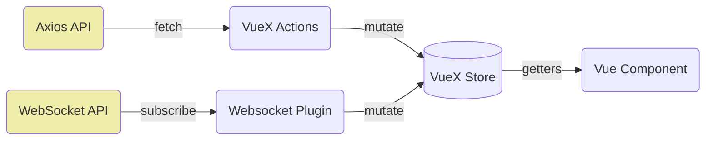

# Web Interface

## Deployment

* Serve static content (Nuxt build) with NGINX
* Reverse proxy `/api/v1/` to Gunicorn
* Gunicorn runs Uvicorn workers `gunicorn balsam:asgi_app -k uvicorn.workers.UvicornWorker`
    * Support HTTP keepalive & websockets
* Run Redis on localhost and use `RedisChannelLayer`
    * [Channels deployment](https://channels.readthedocs.io/en/latest/deploying.html#setting-up-a-channel-backend)

## AsyncWebsocketConsumers

* on `connect()` and `disconnect()`, add/remove self from `balsam_web_user_{id}` group
* model/manager code calls `channel_layer.group_send("balsam_web_user_{id}", {type: "jobs.update", payload})`
* Consumers push these events onto websocket; VueX plugin carries out mutations asynchronously
* Updates contain the full instance, not just a patch.  That way, an update can be have "upsert" semantics on the client store (update or create)

| Resource | Event Type | 
| -------  | ---------- |
| `Site`     | Create, Update, Delete |
| `App`     | Create, Update, Delete |
| `BatchJob`     | Create, Update, Delete |
| `Session`     | Create, Update, Delete |
| `Job`     | CreateList, UpdateList, DeleteList |
| `TransferItem`     | CreateList, UpdateList, DeleteList |
| `LogEvent`     | CreateList, UpdateList, DeleteList |

## Client data flow

API actions do not clobber/overwrite the store; they either update existing
items or create.  Only Websocket "delete" events cause deletion.

- Client establishes Websocket connection first
- Websocket updates start to come in asynchronously
- Client issues initial API actions to fetch and update store:
    * current user info
    * all Sites
    * all Apps
    * all Sessions
    * last 100 BatchJobs
    * last 100 Jobs
    * Site-wise state counts

Any subsequent API actions are for lazy-loading `Jobs`, `BatchJobs`,
`Transfers`, or `LogEvents`:

* JobDataTableView
* HistoryView or BatchJobDetail view
* TransferView

Every GET API action (changing filters, ordering, page number, loading a new
view) does not evict stale data. It should only insert/update fetched data.
Thus, the Store might contain **a lot more** data than the current view is
requesting.  For instance, we might be looking at Jobs that ran in BatchJob a
month ago, while 10k Jobs that ran in the last hour are still in the store and
receiving ongoing Websocket updates.

Vue components use either computed properties or Store Getters to get the
**ordered subset** of data in the rendered view.

!!! note
    As long as the Websocket connection remains alive, `GET` requests shall not
    be repeated on the web client side.  Any changes would have already been
    recorded via the Websocket plugin.  We don't need to cache requests; we
    just remember the list of requests to avoid repeating.  

    If the Websocket connection is interrupted, we can clear the list of
    past GET requests to refresh data that may have been lost in the interim.
