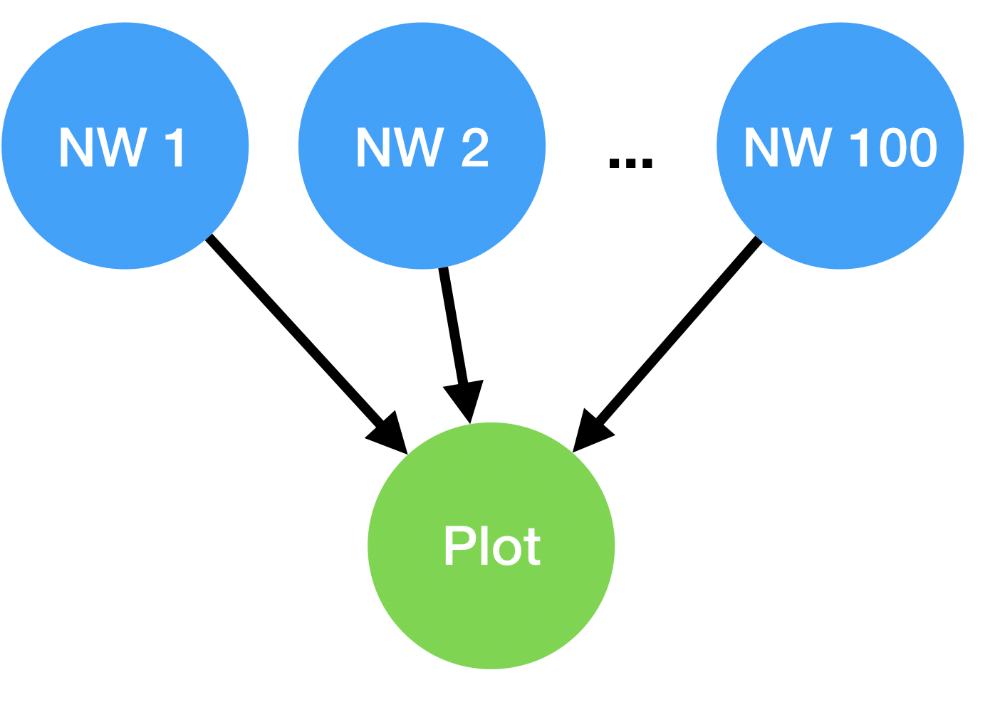

# NWChem: Parameter Sweep and Pre/Post-processing

Even if you are not interested in Chemistry, this tutorial illustrates
several important Balsam concepts:

  -   Setting up an Application that requires several modules to run
  -   Pre-processing to generate input files
  -   Post-processing to parse and store calculation results
  -   Storing JSON data with PostgreSQL
  -   Creating a large parameter sweep-type ensemble
  -   Adding a reduce-type (summary) job using `dag.add_dependency()`

Water HF/6-31G Potential Energy Scan
------------------------------------

In this exercise, we'll use NWChem on Theta to calculate the electronic
ground state energy of the water molecule. We would like to repeat this
calculation many times as a function of the symmetric O\--H bond
stretching distance, in order to generate a 1-dimensional potential
energy surface (PES).

Let's see how an existing build of NWChem on Theta (courtesy of Alvaro
Vazquez-Mayagoitia) can be used in a Balsam workflow to generate the
water PES.

Setting Up
----------

Let's create a clean workspace and Balsam DB for this exercise as
follows.

``` {.bash}
$ rm -r ~/.balsam  # reset default settings (for now)
$ mkdir ~/tut-nwchem
$ cd ~/tut-nwchem
$ module load balsam
$ balsam init db
$ . balsamactivate db
```

The NWChem Application
----------------------

Suppose we were looking for a public build of NWChem on Theta. We search in
`/soft/applications` and find the binary
`/soft/applications/nwchem/6.8/bin/nwchem` alongside a `submit.sh` script to
launch a run. In order for NWChem to run properly, this script loads some
modules and sets many MPICH environment variables.

The easiest way to create this NWChem environment is Balsam is to copy all of
the `module load` and `export` statements into the `envscript` of our NWChem
`ApplicationDefinition`. We first copy over the file: `cp
/soft/applications/nwchem/6.8/bin/submit.sh envs.sh` and then delete the
launch commands, so it's only setting up the environment like this:

```bash
#!/bin/bash
# envs.sh 
module add atp
module add intel

export MPICH_GNI_MAX_EAGER_MSG_SIZE=16384 
export MPICH_GNI_MAX_VSHORT_MSG_SIZE=10000 
export MPICH_GNI_MAX_EAGER_MSG_SIZE=131072 
export MPICH_GNI_NUM_BUFS=300 
export MPICH_GNI_NDREG_MAXSIZE=16777216 
export MPICH_GNI_MBOX_PLACEMENT=nic 
export MPICH_GNI_LMT_PATH=disabled 
export COMEX_MAX_NB_OUTSTANDING=6
```

Instead of defining applications from the command line, we can write a
small Python script:

```python
#!/usr/bin/env python
# apps.py
'''Register the two Applications'''
import os
from balsam.core.models import ApplicationDefinition as App

if not App.objects.filter(name="nwchem-water").exists():
    nwchem = App(
        name = 'nwchem-water',
        executable = '/soft/applications/nwchem/6.8/bin/nwchem',
        preprocess = os.path.abspath('pre.py'),
        postprocess = os.path.abspath('post.py'),
        envscript = os.path.abspath('envs.sh'),
    )
    nwchem.save()

if not App.objects.filter(name="plot-pes").exists():
    plotter = App(
        name = 'plot-pes',
        executable = os.path.abspath('plot.py')
    )
    plotter.save()
```

You'll notice this script provides pre- and post-processing scripts for
**nwchem-water**, as well as a second **plot-pes** app. We will get to
these shortly. First, let's write this **plot-pes** script.

The "Plotting" Application
----------------------------

After our PES scan is completed, we would like to generate a summary
plot of the data. This can be accomplished by adding a **plot-pes** task
as the child of all the **nwchem-water** tasks. Creating these
dependencies will form a DAG, as shown in the figure below. The plot
step only runs after all the parent NWChem calculations have finished
succesfully.

The DAG consists of several independent NWChem single-point energy
tasks, followed by a data-summarization task that depends on successful
completion of all the energy
calculations.



Now create the plot script as shown below. The highlighted lines show
how the task will find its parent tasks through the Python API. The
results are organized by pulling O\--H bond length (*r*) and the
electronic energy (*energy*) from each nwchem-water task's **data**
dictionary.

```python
#!/usr/bin/env python
# plot.py

'''Summarize results in plottable text format'''
from balsam.launcher.dag import current_job

results = [
    (task.data['r'], task.data['energy'])
    for task in current_job.get_parents()
]

results = sorted(results, key=lambda pair: pair[0])
print("%18s %18s" % ("O-H length / Ang", "Energy / a.u."))
for r,e in results:
    print("%18.3f %18.6f" % (r,e))
```

Creating the Workflow
---------------------

We can write a simple script to create one instance of this workflow.
The steps include:

 -   Defining a grid of *r* values
 -   Creating a **nwchem-water** task for each r value
 -   Creating a **plot-pes** task
 -   Adding a Dependency from each **nwchem-water** parent task to the
     **plot-pes** task

The script should look as follows. One line is highlighted for each of
the four steps listed above. You will notice that we are setting the
**data** attribute in the BalsamJob constructor for each
**nwchem-water** task. This field can hold arbitrary JSON data; it is
stored efficiently in a Postgres binary format (JSONB) and is [readily
queried with
Django](https://docs.djangoproject.com/en/2.1/ref/contrib/postgres/fields/#querying-jsonfield).

```python
#!/usr/bin/env python
# populate.py
'''Add Water potential energy scan tasks to DB'''

from balsam.launcher.dag import BalsamJob, add_dependency
import numpy as np

r_grid = np.linspace(0.8, 1.3)

water_scan = []
for i, r in enumerate(r_grid):
    job = BalsamJob(
        name=f"task{i}",
        workflow="demo",
        description=f"r = {r:.3f}",
        application = "nwchem-water",
        args = "input.nw",
        num_nodes = 1,
        ranks_per_node = 64,
        cpu_affinity = "depth",
        data = {'r':r, 'theta': 104.5},
    )
    water_scan.append(job)
    job.save()

plotjob = BalsamJob(
    name="plot",
    application="plot-pes",
    workflow="demo",
    input_files="",
)
plotjob.save()
for job in water_scan:
    add_dependency(parent=job, child=plotjob)
```

Preprocess: Generating NWchem input
-----------------------------------

We need to create an input file for each NWChem calculation before it
runs. We can do this in the **preprocess** script
`pre.py` that is used in the **nwchem-water** ApplicationDefinition. This script:

 -   uses `balsam.launcher.dag.current_job`{.interpreted-text
     role="bash"} to grab the context of the current job
 -   reads the internal coordinates (*r*, *theta*) from the task
     **data** field
 -   converts to Cartesian (*xyz*) coordinates
 -   writes-out an input deck for a Hartree Fock calculation in the
     6-31G basis

The four steps above are mapped to the highlighted lines in the script
below:

```python
#!/usr/bin/env python
# pre.py 
'''Generate input file for NWChem'''

import numpy as np 
from balsam.launcher.dag import current_job

def water_cartesian(r, theta):
    cost = np.cos(np.radians(theta))
    sint = np.sin(np.radians(theta))
    O = ['O', 0.0, 0.0, 0.0]
    H1 = ['H', r, 0.0, 0.0]
    H2 = ['H', r*cost, r*sint, 0.0]
    return (O,H1,H2)

def input_deck(cartesian_coords):
    coords = [' '.join(map(str, c)) for c in cartesian_coords]
    return f'''
    start h2o
    title "Water in 6-31g basis"

    geometry
    {coords[0]}
    {coords[1]}
    {coords[2]}
    end
    basis
    * library 6-31g
    end
    task scf
    '''

data = current_job.data
r, theta = data['r'], data['theta']
coords = water_cartesian(r, theta)
with open('input.nw', 'w') as fp:
    fp.write(input_deck(coords))
```

!!! note 
    Pre- and Post-processing scripts run in the task's working directory, so
    we don't have to worry about absolute paths when opening files.

Postprocess: Parse and store NWChem output
------------------------------------------

The last piece of our workflow is the `post.py` script responsible for
collecting NWChem outputs after each **nwchem-water** task finishes.
Note that that the output (both stdout and stderr) of each task are directed
to a file named `{job.name}.out`. 
We simply scan through the lines of this file and extract the final HF
energy. Finally, we store it in the JSON **data** field so the **plot-pes**
step can find this result at the end.

```python
#!/usr/bin/env python
# post.py
'''Parse Energy from NWChem output'''

from balsam.launcher.dag import current_job

outfile = current_job.name + ".out"
energy = None

with open(outfile) as fp:
    for line in fp:
        if 'Total SCF energy' in line:
            energy = float(line.split()[-1])
            break

current_job.data['energy'] = energy
current_job.save()
```

!!! note
    Post-processing scripts can also be used to programatically handle
    errors. This is enabled by setting the `post_error_handler=True` flag in
    the BalsamJob, and inspecting the `current_job.state` in the
    postprocessor. In this tutorial, the postprocess is only invoked after
    successful completion of runs.

Putting it All Together
-----------------------

Now we can populate the DB with our ApplicationDefinitions and workflow,
then submit a job and watch it go. We need to be sure that our scripts
are executable, since our scripts are registered directly as executables.
It would also have been fine to set `python /path/to/pre.py` as the preprocess,
without making `pre.py` itself executable, for instance.

```.bash
$ chmod +x *.py  # set exe permission
$ python apps.py # populate apps
$ balsam ls apps --verbose # check apps in DB

$ python populate.py
$ balsam ls # check jobs in DB

$ balsam submit-launch -n 5 -t 60 -A Project -q Queue --job-mode=mpi
```

When the workflow starts running, the Balsam command line is a great way
to quickly navigate the tasks and see the status of everything in
realtime. Follow along to learn some of the navigation tricks below:

``` {.bash}
# count up jobs by state
$ balsam ls --by-states 
JOB_FINISHED  10
RUNNING  5
PREPROCESSED  85
AWAITING_PARENTS  1


# list finished jobs only
$  balsam ls --state JOB_FINISHED 

                              job_id |   name | workflow |  application |        state
--------------------------------------------------------------------------------------
159070cb-03f8-4a37-9ed1-66bfb906e4bb | task4  | demo     | nwchem-water | JOB_FINISHED
db12a2e7-f8b1-4eb5-9c03-5bb0c4ac74f8 | task3  | demo     | nwchem-water | JOB_FINISHED
72d7f99e-76a5-495d-9d5f-648e0582e3a4 | task2  | demo     | nwchem-water | JOB_FINISHED


# change directory (cd) to task with job_id starting with 1590
$ . bcd 1590  
$ ls
h2o.movecs  h2o.p  h2o.zmat  input.nw  postprocess.log  preprocess.log  task4.out

# This one is cool: use BALSAM_LS_FIELDS to add "data" to the table display
# Then list finished jobs to see the results at a glance!
$  BALSAM_LS_FIELDS=data balsam ls --state JOB_FINISHED
                              job_id |   name | workflow |  application |        state |                                                                  data
--------------------------------------------------------------------------------------------------------------------------------------------------------------
159070cb-03f8-4a37-9ed1-66bfb906e4bb | task4  | demo     | nwchem-water | JOB_FINISHED | {'r': 0.8408163265306123, 'theta': 104.5, 'energy': -75.949402426371}
db12a2e7-f8b1-4eb5-9c03-5bb0c4ac74f8 | task3  | demo     | nwchem-water | JOB_FINISHED | {'r': 0.8306122448979593, 'theta': 104.5, 'energy': -75.941790242862}
72d7f99e-76a5-495d-9d5f-648e0582e3a4 | task2  | demo     | nwchem-water | JOB_FINISHED | {'r': 0.8204081632653062, 'theta': 104.5, 'energy': -75.93319131096}
e667e9e8-b77d-4e78-9b73-f5084cc62e3a | task7  | demo     | nwchem-water | JOB_FINISHED | {'r': 0.8714285714285714, 'theta': 104.5, 'energy': -75.966950538242}
77ecaf92-e462-49b2-8823-2d5a9c449528 | task49 | demo     | nwchem-water | JOB_FINISHED | {'r': 1.3, 'theta': 104.5, 'energy': -75.863011732378}
6ca50987-d509-43aa-9604-da1d0d625a82 | task3  | demo     | nwchem-water | JOB_FINISHED | {'r': 0.8306122448979593, 'theta': 104.5, 'energy': -75.941790242862}
46f689e1-7a1a-49b7-bc74-4d058b6faa1b | task19 | demo     | nwchem-water | JOB_FINISHED | {'r': 0.9938775510204082, 'theta': 104.5, 'energy': -75.981078202929}
b83a6cb2-5ad9-44aa-b28b-d665bbbfbedf | task10 | demo     | nwchem-water | JOB_FINISHED | {'r': 0.9020408163265307, 'theta': 104.5, 'energy': -75.977730477137}
b618dcbf-1e49-46e9-9b2f-b0ee69904dfc | task1  | demo     | nwchem-water | JOB_FINISHED | {'r': 0.8102040816326531, 'theta': 104.5, 'energy': -75.923535853437}
ac765c84-6544-4bf0-9f60-b898cb6ec117 | task2  | demo     | nwchem-water | JOB_FINISHED | {'r': 0.8204081632653062, 'theta': 104.5, 'energy': -75.93319131096}

# Check on the Plot step
$ balsam ls --name plot
                            job_id   | name | workflow | application |   state
------------------------------------------------------------------------------
fce9ecb3-b025-4e18-b499-a5c21e97e4ee | plot | demo     | plot-pes    | JOB_FINISHED

# Change to the plot dir
$ . bcd fce9
$ cat plot.out
```
