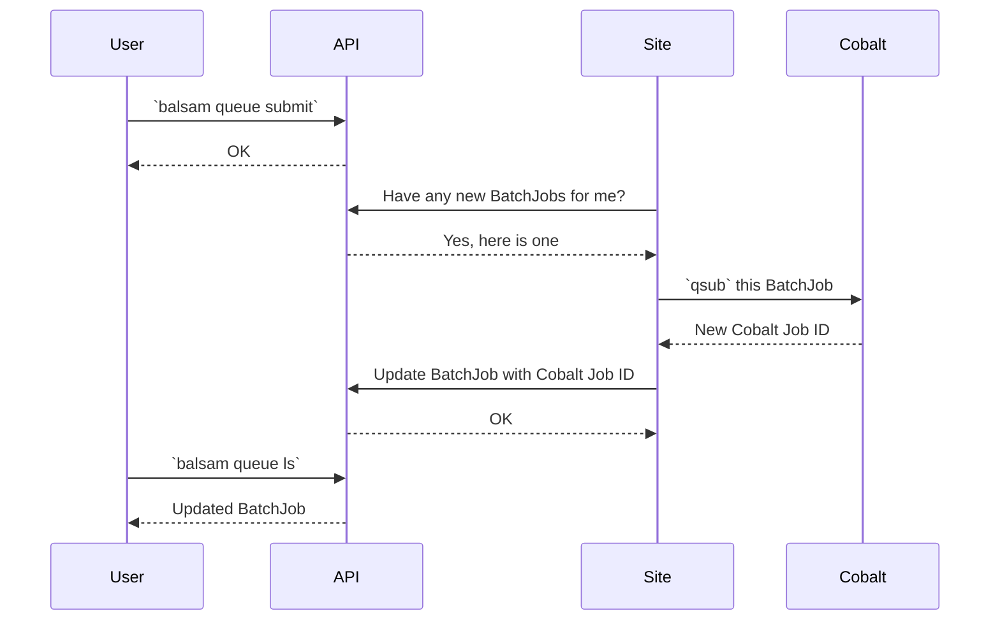

# Running on Theta

## Installation

First create a new virtualenv and install it on Balsam:

```
$ /soft/datascience/create_env.sh my-env # Or do it yourself
$ source my-env/bin/activate
$ git clone https://github.com/balsam-alcf/balsam.git
$ cd balsam/
$ git checkout develop
$ pip install -e .
```

## Log In 

Now you will need to create a Balsam user account and log in.  Logging in fetches an access token
that is used to identify you in subsequent API interactions, until the token expires and you have to log in again.
```
$ balsam register
Balsam server address: http://generic-01:8000
# Set your own username and password
# Use a "throwaway" password since it's transmitted over plaintext for now

$ balsam login
# Follow the prompts to log into http://generic-01:8000
# With the credentials you used to register
```


## Create a Balsam site

While the database is centrally located on the `generic-01` host and shared, users will still 
create their own directories where Jobs run.  Each Balsam execution directory is called a **Site**. 
A User can own many **Sites** across different HPC systems, or even have **Sites** configured on their laptop.

Instead of creating a database with `balsam init`, we will create our first Balsam **Site** as follows:

```
$ export BALSAM_LOG_LEVEL=WARNING   # to avoid excessive logs on the CLI for now
$ balsam site init my-site
# Select the default configuration for Theta-KNL
$ cd my-site
$ balsam site ls
# You should see the details of the Site that was just created
```

## Set up your Apps

Every `App` in Balsam is now fully-specified by an `ApplicationDefinition` class that you write.
You can add Apps to modules in the Site `apps/` folder, with multiple apps per Python module file and multiple files.
Every Site comes "pre-packaged" with some default Apps that Balsam developers have pre-configured for that particular HPC system.

You are to modify, delete, and add your own apps.  To make a new app, you can simply copy one of the existing `App` modules as a 
starting point, or you can use the command line interface to generate a new template app:

```
$ balsam app create
Application Name (of the form MODULE.CLASS): test.Hello
Application Template [e.g. 'echo Hello {{ name }}!']: echo hello {{ name }} && sleep {{ sleeptime }} && echo goodbye
```

Now open `apps/test.py` and see the `Hello` class that was generated for you.  The allowed parameters for this App are given in 
double curly braces: `{{ name }}` and `{{ sleeptime }}`.  When you add `test.Hello` jobs, you will have to pass these two parameters 
and Balsam will take care of building the command line.  

The other components of an App are also defined directly on the `ApplicationDefinition` class, rather than in other files:

- `preprocess()` will run on Jobs immediately before `RUNNING`
- `postprocess()` will run on Jobs immediately after `RUN_DONE`
- `shell_preamble()` takes the place of the `envscript`: return a multiline string envscript or a `list` of commands
- `handle_timeout()` will run immediately after `RUN_TIMEOUT`
- `handle_error()` will run immediately after `RUN_ERROR`

Whenever you have changed your `apps/` directory, you need to inform the API about the changes.  All it takes is a single command
to sync up:
```
$ balsam app sync
$ balsam app ls
# Now you should see your newly-created App show up
```

Note that the API does not store *anything* about the `ApplicationDefinition` classes other than the class name and some metadata
about allowed parameters, allowed data transfers, etc...  What actually runs at the Site is determined entirely from the class
on the local filesystem.

## Add Jobs

To create jobs from the CLI:
```
# Get help:
$ balsam job --help
$ balsam job create --help

# Create a couple jobs:
$ balsam job create --app test.Hello --workdir test/1 --param name="world" --param sleeptime=2
$ balsam job create --app test.Hello --workdir test/2 --param name="balsam" --param sleeptime=1
```

To create jobs from the Python API:

```python
from balsam.config import SiteConfig
 
# This boilerplate can be hidden in the future:
cf = SiteConfig()
client = cf.client
App, Job = client.App, client.Job 

hello_app = App.objects.get(site_id=cf.site_id, class_path="test.Hello")
for i in range(10):
    job = Job(
        f"test-api/{i}", 
        hello_app.id, 
        parameters={"name": "testing!", "sleeptime": "3"},
        node_packing_count=16,
    )
    job.save() # Don't do this for thousands of jobs!

# For many jobs, you can save yourself all the unnecessary API round trips
# by building a list of Jobs and passing them to BalsamJob.objects.bulk_create()
```

Your jobs can be viewed from the CLI:
```
$ balsam job ls
```

## Running the Site

Any Balsam CLI or API interaction that you perform, other than the ones that bootstrap
a new Site, does not affect the HPC system directly.  Instead, a daemon running on your
behalf at the Balsam Site **pulls** state changes from the API and applies that state within
the local Site environment.



For instance, commands like `balsam queue submit` will not actually do
anything with the queue if the Site is not running: they just update the
central API. To start the Site:

```
$ balsam site start
```

The Site will run in the background, sync with API, perform qsub/qstat, initiate data transfers,
and pre/post-process  jobs.  It can eventually be stopped with:

```
$ balsam site stop
```

## Submitting a Job

Now we can submit a BatchJob via the API and watch it appear in Cobalt:

```
$ balsam queue submit -q debug-cache-quad -A datascience -n 1 -t 10 -j mpi 
$ watch "qstat -u $USER && balsam queue ls"
```

When the BatchJob starts, an MPI mode launcher should run the jobs.  You will see (copious) logs in the `logs/`  directory showing what's going on.  Track the Job statuses with:

```
$ balsam job ls
```

All of the workdirs that are created will be visible  under the `data/` directory.
