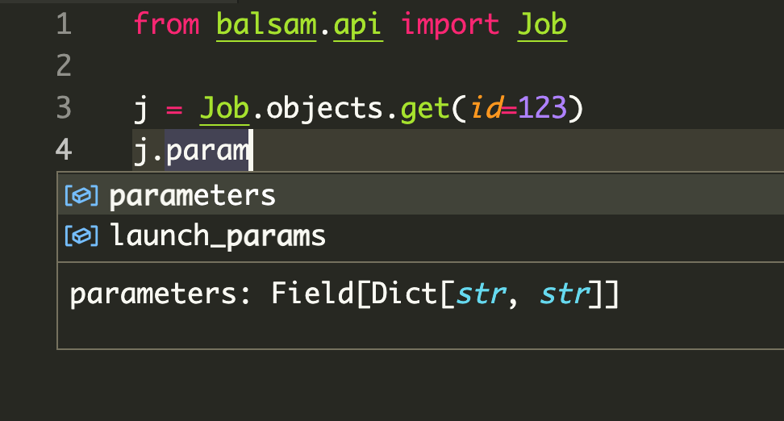

# The Python API

The documentation alludes to the Balsam Python API in several places.  For
instance, the Managing Jobs section gives [real-world examples of API usage in
creating, querying, and updating Jobs](./jobs.md#api-job-creation).  In this
section, we take a step back and look more *generally* at the structure and
semantics of Balsam's Python API.  This is useful because all the Python API
resources (`Site`, `App`, `Job`, `BatchJob`, ...) share the same methods and
data structures for creating, querying, updating, and deleting resources.

The first thing to understand is that the Python API is merely a **convenience
layer** built on top of a standard HTTP 
[requests](https://docs.python-requests.org/en/master/) client. One could bypass
`balsam.api` altogether and interact with the Balsam REST API using another
programming language or a command-line tool like `curl`.

Resources are imported at the top-level from `balsam.api`:

```python
from balsam.api import (
    Site,
    App,
    Job,
    BatchJob,
    TransferItem,
    EventLog,
)
```

The following sections use `Job` as an example but easily
generalize to any of the resources imported above.
For example, querying your `Sites` looks just like querying your `Jobs`:

```python
from datetime import datetime, timedelta

hour_ago = datetime.utcnow() - timedelta(hours=1)

recently_used_sites = Site.objects.filter(last_refresh_after=hour_ago)
recently_updated_jobs = Job.objects.filter(last_update_after=hour_ago)
```

Once again, the docstrings and type annotations visible in a Python IDE are
**hugely helpful** in discovering the allowed parameters for various resources.
Best of all, because the Python API is *dynamically generated* from the REST API
schema, the Python docstrings and type hints stay up to date, even if this user
guide lags behind! 

## Model Fields

Each of the API resources has a model class (like `Job`) which
defines a set of Fields that can be exchanged with the REST API.
The model fields are type-annotated and can be explored from your IDE or class docstrings.  For example, we can start searching for "param" and find that `job.parameters` should be a dictionary of strings:



!!! note "Relationship to Django ORM"
    Previous versions of Balsam used the real [Django
    ORM](https://docs.djangoproject.com/en/3.2/topics/db/queries/) to
    communicate with a private user database.  This proved to be an effective
    programming model, and so the new Balsam Python API was written to
    preserve a subset of the structure and syntax of the former API.

    If you peek below the surface, the current Balsam Python API is completely
    different from an ORM. Whereas ORMs lazily execute SQL queries over a
    database connection, the Balsam API executes HTTPS requests over an Internet
    connection. It wraps one specific REST API schema and is therefore
    vastly narrower in scope and capabilities.

## Creating
Each resource has three methods of construction.  First, you can create 
several in-memory instances, and later persist them to the backend:

```python
# Create in-memory with the required kwargs...
j = Job(...)

# New in-memory resources have no ID:
assert j.id is None

# ...then persist:
j.save()
assert j.id is not None
```

Second, you can create and persist in a single step:

```python
j = Job.objects.create(...)
assert j.id is not None
```

Third, you can bulk-create from a collection of in-memory resources:

```python
jobs = [Job(**kwargs) for kwargs in job_specs]
Job.objects.bulk_create(jobs)
for job in jobs:
    assert job.id is not None
```

## Updating

If we change some fields on an existing instance, we can update it by calling
`save()`.  The Python API is aware that if the resource `id` is set, you mean to
*update an existing resource* rather than *create a new one*.

```python
job.state = "RESTART_READY"
job.save()
```

If want to load recent changes to an in-memory resource:

```python
# Re-fetch the Job & update fields:
job.refresh_from_db()
```

We can apply the same change to every item matching a particular `Query`:

```python
# Select all FAILED jobs, change num_nodes=1, and mark for retry
Job.objects.filter(state="FAILED").update(num_nodes=1, state="RESTART_READY")
```

If we need to perform a large list of *different* updates, we can pass a list of mutated instances:

```python
# Mutated jobs to be updated, each in their own way:
Job.objects.bulk_update(modified_jobs)
```

## Deleting

We can delete individual resources:

```python
job.delete()
assert job.id is None
```

Or we can bulk-delete querysets:

```python
Job.objects.filter(state="FAILED").delete()
```

## Querying

Each class has a manager (for instance `Job.objects` is a `JobManager`) which generates `Query` objects.

### All

We can start with a query returning *all* items with `all()`

```python
for job in Job.objects.all():
    print(job)
```

### Filter

We can chain queries one-after-another by providing additional
sets of filter parameters:

```python
# These 3 chained queries...
all_jobs = Job.objects.all()
foo_jobs = all_jobs.filter(tags={"experiment": "foo"})
failed_foo_jobs = foo_jobs.filter(state="FAILED")

# ...are equivalent to this 1 query:
failed_foo_jobs = Job.objects.filter(
    tags={"experiment": "foo"},
    state="FAILED"
)
```

### Order By and Slicing

When there are hundreds of thousands of Jobs matching your query, it makes sense to *order* on some criterion and take chunks with the slicing operator:

```python
# 1000 most recent failures
Job.objects.filter(state="FAILED").order_by("-last_update")[0:1000]
```

Under the hood, the `[0:1000]` slice operation adds `limit` and `offset` to the HTTP query parameters, generating an efficient request that does not fetch more data than you asked for!

### Get

If our query should return **exactly one** object, we can use `get()` instead of
`filter()` to return the object directly.  This method raises a model-scoped
`DoesNotExist` error if the query returned 0 items, or `MultipleObjectsReturned`
if more than 1 item was found.  We can catch these errors that arise when when
exactly one unique object is expected:

```python
try:
    h2o_job = Job.objects.get(tags={"system": "H2O"})
except Job.DoesNotExist:
    print("There is no finished H2O job!")
except Job.MultipleObjectsReturned:
    print("There is more than one finished H2O job!")
```


### Count

We can use `count()` to fetch the number of items matching a query, without actually fetching the list of items.  This can be useful to quickly tally up large numbers of `Jobs`:

```python
for state in ["RUNNING", "JOB_FINISHED"]:
    count = Job.objects.filter(state=state).count()
    print(state, count)
```

### First

To grab the first item from a query we can use either syntax:

```python
one = Job.objects.filter(state="RUNNING")[0]

same_thing = Job.objects.filter(state="RUNNING").first()
```


## Lazy Query Evaluation

We can build queries with `filter`, chain them together, add `order_by` clauses, apply `[start:end]` slices, and store these queries in Python variables. **None of these actions fetches data because queries are lazily evaluated.**

```python
# This doesn't fetch any Jobs yet:
failed_jobs = Job.objects.filter(state="FAILED")
```

When a query is **evaluated** by iteration or some other method, its result is
cached, so that repeated iterations over the same query variable do not trigger
redundant requests.  

```python
# This triggers the HTTP request:
for job in failed_jobs:
    print(job)

# This re-uses the cached result:
for job in failed_jobs:
    print("Again!", job)

# We can explicitly force iteration and store the result:
running_jobs = list(Job.objects.filter(state="RUNNING"))
```

### Length

Evaluating the `len(query)` forces fetching the result set and returns its
length.  If you only want the count without fetching the items, its more
efficient to use the `count()` method mentioned above.

### Boolean Value

Evaluating the query with `if query` also triggers evaluation, and the query
evaluates to `True` if there is at least one object in the result set; it's `False` otherwise.