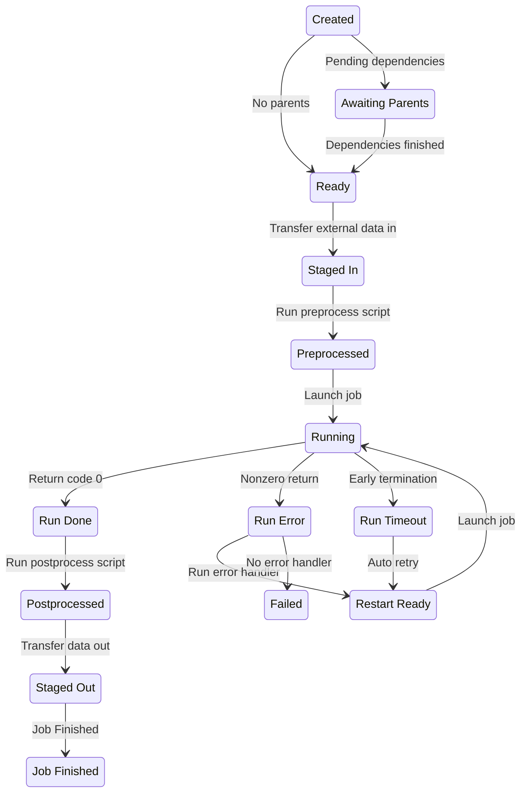

# Balsam Jobs

## Key Concept: The Job Lifecycle

The Balsam `Job` represents a single invocation of [an `App`](./appdef.md) on
some specified computing resources. Each `Job` is a stateful object that
advances through a lifecycle of **states** (from `CREATED` to `JOB_FINISHED` in
a successful flow).  

After [defining the requisite `Apps`](./appdef.md#writing-applicationdefinitions), we create a collection
of `Jobs`. Each Job specifies any data transfer or inter-job
dependencies. The collection of `Jobs` represents our workflow, which is then
executed by Balsam over time.


In the normal (successful) flow of execution, a `Job` moves through the
following sequence of states.  The table below defines each state as well as the 
action performed by Balsam to move the job toward the next state.

| State              | Meaning                                     | Next Balsam Action                                     |
| ------------------ | ------------------------------------------- | -----------------------------------------------        |
| `CREATED`          | Job initially submitted.                    | Check the parent Job and data transfer dependencies    |
| `AWAITING_PARENTS` | Pending parent job dependencies.            | Advance to `READY` when all parents finished           |
| `READY`            | All parent jobs have finished.              | Submit any stage-in transfer tasks                     |
| `STAGED_IN`        | All data dependencies staged in.            | Call the [`preprocess()` hook][preproc]                |
| `PREPROCESSED`     | The `preprocess` hook completed.            | Acquire and launch the executable on a compute node    |
| `RUNNING`          | Started executing on a compute node.        | Poll the executing Job process's return code           |
| `RUN_DONE`         | Execution finished with return `0`.         | Call the [`postprocess()` hook][pstproc]               |
| `POSTPROCESSED`    | The `postprocess` hook completed.           | Submit any stage-out transfer tasks                    |
| `STAGED_OUT`       | All stage-out transfers completed.          | Mark the job `JOB_FINISHED`                            |
| `JOB_FINISHED`     | The job has completed processing.           | **Nothing (end state)**                                |

Additionally, Balsam defines the following exceptional states for handling jobs
that encounter errors or early termination:

| State              | Meaning                                     | Next Balsam Action                                     |
| ------------------ | ------------------------------------------- | -----------------------------------------------        |
| `RUN_ERROR`        | Execution finished with nonzero returncode. | Call the [`handle_error()` hook][errorhn]              |
| `RUN_TIMEOUT`      | Execution was terminated mid-run.           | Call the [`handle_timeout()` hook][tmouthn]            |
| `RESTART_READY`    | Job is ready to run again.                  | Acquire and launch the executable on a compute node    |
| `FAILED`           | Completed processing (unsuccessfully).      | **Nothing (end state)**                                |

Hopefully, it's clear from these state flows that a `Job` can be thought of as
the workflow surrounding a **single App run**. You should check out [specific
examples of the Balsam hooks](./appdef.md#job-lifecycle-hooks) that can be used
to build interesting workflows at the `ApplicationDefinition` level. If we don't
define any special hooks or data transfers, most of the steps listed above are
*no-ops* and the `Job` simplifies down to a simple run of an App command.

Of course, we can also build DAGs or ensembles of *many* application runs by
creating multiple `Jobs`,  potentially specifying inter-`Job` dependencies.  We
will show effective methods for creating large batches of Jobs later on.  To
conclude this section, the **state diagram** below summarizes the Job lifecycle
by illustrating the common state flows.

[preproc]: ./appdef.md#the-preprocess-hook
[pstproc]: ./appdef.md#the-postprocess-hook
[errorhn]: ./appdef.md#error-handler
[tmouthn]: ./appdef.md#timeout-handler




## Creating Jobs
-  the fields
-  the resources

### How Resources are Managed by the Launcher

### API Job Creation

- mention bulk
- by app ID, or name&site

### CLI Job Creation

### Creating Dependencies

### Creating TransferItems


## Querying Jobs

- ordering
- 
### How to use Tags

### API Queries

### The CLI Queries

## Accessing Parent Jobs with API

## Resolving the Job Workdir

## Accessing Job Data

## Querying Job Events

- refer to Analytics

## Updating Jobs with API

## Deleting Jobs with API

```python
def preprocess(self):
    parents = self.job.parent_query()
    for parent in parents:
        print("Parent workdir:", parent.workdir)
    self.job.state = "PREPROCESSED"
```