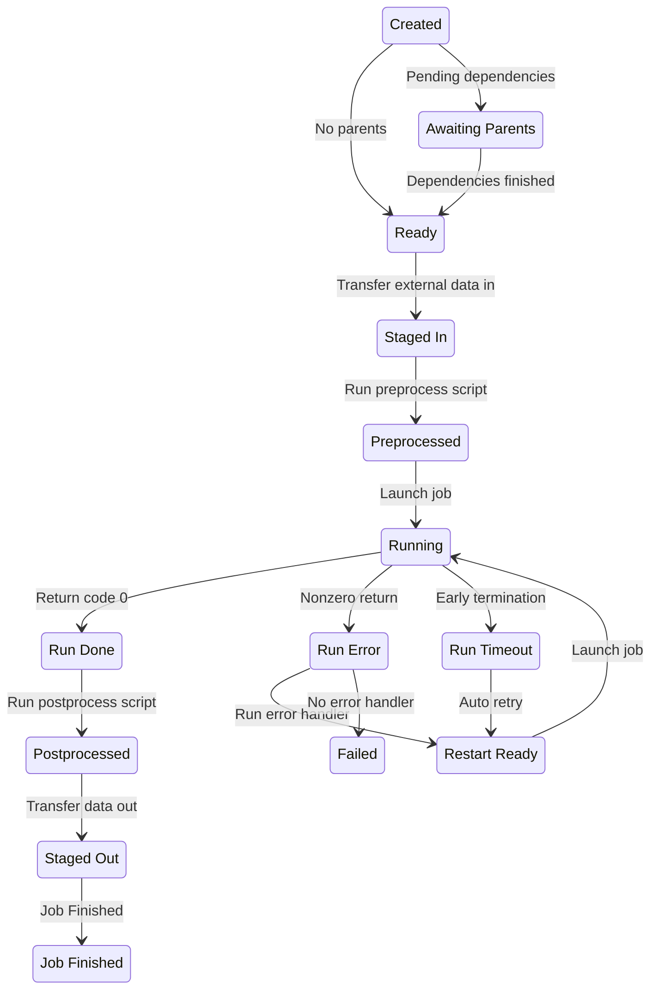

# Balsam Jobs

## Key Concept: The Job Lifecycle

The Balsam `Job` represents a single invocation of [an `App`](./appdef.md) on
some specified computing resources. Each `Job` is a stateful object that
advances through a lifecycle of **states** (from `CREATED` to `JOB_FINISHED` in
a successful flow).  

After [defining the requisite `Apps`](./appdef.md#writing-applicationdefinitions), we create a collection
of `Jobs`. Each Job specifies any data transfer or inter-job
dependencies. The collection of `Jobs` represents our workflow, which is then
executed by Balsam over time.


In the normal (successful) flow of execution, a `Job` moves through the
following sequence of states.  The table below defines each state as well as the 
action performed by Balsam to move the job toward the next state.

| State              | Meaning                                     | Next Balsam Action                                     |
| ------------------ | ------------------------------------------- | -----------------------------------------------        |
| `CREATED`          | Job initially submitted.                    | Check the parent Job and data transfer dependencies    |
| `AWAITING_PARENTS` | Pending parent job dependencies.            | Advance to `READY` when all parents finished           |
| `READY`            | All parent jobs have finished.              | Submit any stage-in transfer tasks                     |
| `STAGED_IN`        | All data dependencies staged in.            | Call the [`preprocess()` hook][preproc]                |
| `PREPROCESSED`     | The `preprocess` hook completed.            | Acquire and launch the executable on a compute node    |
| `RUNNING`          | Started executing on a compute node.        | Poll the executing Job process's return code           |
| `RUN_DONE`         | Execution finished with return `0`.         | Call the [`postprocess()` hook][pstproc]               |
| `POSTPROCESSED`    | The `postprocess` hook completed.           | Submit any stage-out transfer tasks                    |
| `STAGED_OUT`       | All stage-out transfers completed.          | Mark the job `JOB_FINISHED`                            |
| `JOB_FINISHED`     | The job has completed processing.           | **Nothing (end state)**                                |

Additionally, Balsam defines the following exceptional states for handling jobs
that encounter errors or early termination:

| State              | Meaning                                     | Next Balsam Action                                     |
| ------------------ | ------------------------------------------- | -----------------------------------------------        |
| `RUN_ERROR`        | Execution finished with nonzero returncode. | Call the [`handle_error()` hook][errorhn]              |
| `RUN_TIMEOUT`      | Execution was terminated mid-run.           | Call the [`handle_timeout()` hook][tmouthn]            |
| `RESTART_READY`    | Job is ready to run again.                  | Acquire and launch the executable on a compute node    |
| `FAILED`           | Completed processing (unsuccessfully).      | **Nothing (end state)**                                |

Hopefully, it's clear from these state flows that a `Job` can be thought of as
the workflow surrounding a **single App run**. You should check out [specific
examples of the Balsam hooks](./appdef.md#job-lifecycle-hooks) that can be used
to build interesting workflows at the `ApplicationDefinition` level. If we don't
define any special hooks or data transfers, most of the steps listed above are
*no-ops* and the `Job` simplifies down to a simple run of an App command.

Of course, we can also build DAGs or ensembles of *many* application runs by
creating multiple `Jobs`,  potentially specifying inter-`Job` dependencies.  We
will show effective methods for creating large batches of Jobs later on.  To
conclude this section, the **state diagram** below summarizes the Job lifecycle
by illustrating the common state flows.

[preproc]: ./appdef.md#the-preprocess-hook
[pstproc]: ./appdef.md#the-postprocess-hook
[errorhn]: ./appdef.md#error-handler
[tmouthn]: ./appdef.md#timeout-handler




## Creating Jobs

To create a `Job`, we need to supply arguments via the Python API's `Job()` constructor
*or* the `balsam job create` CLI.  Most fields are optional and take sensible default values.
At a minimum, we must always supply:
  
- `app_id` *or* `app_name` and `site_path`: reference to the specific `App`
- `workdir`: the working directory, *relative* to the Site's `data/` path
- Any `parameters` required by the `ApplicationDefinition`'s command template
- Any `transfers`  items required by the `ApplicationDefinition`

### CLI Job Creation

The [quickstart tutorial](../tutorials/theta-quickstart.md) showed an example of CLI job creation:

```bash
$ balsam job create --app demo.Hello --workdir test/1 --param name="world"
```

If `-a/--app` doesn't unambiguously specify an App by its [class path](./appdef.md#the-class-path), you can provide the numeric app ID (revealed by `balsam app ls`) or target a specific site [using the `--site` selector](./cli.md).

By passing `test/1` to the `-w/--workdir` option, we declare that the job should
run in the `data/test/1/` subdirectory of the Site.  This folder will be created
automatically.

Finally, multiple command template parameters can be passed by repeated
`-p/--param` arguments.  In the example above we have only one parameter called
`name` and provide a value of `"world"`.

!!! note "Multiple Arguments"
    Run `balsam job create --help` to list the various options and example
    usage.  For any option that takes multiple arguments, they should be provided by repeating the flag. For instance, `balsam job create --tag foo=xyz --tag experiment=initial` will create a job with two tags.

### API Job Creation

You will usually prefer to leverage the flexibility of Python to populate a
large number of `Jobs` programatically. For example, a common pattern in Balsam
is to write a quick one-off script to crawl a directory of input files and
generate a Job for each one.  Our entrypoint to creating `Jobs` from Python is the Balsam `Job` API:

```python
from balsam.api import Job
```

!!! note "Take advantage of the docstrings and type annotations!"
    We strongly recommend using the Balsam APIs in an interactive development
    environment such as a Jupyter Notebook or Python IDE of choice.  Each Balsam
    model defined under `balsam.api` includes detailed docstrings and type
    annotations for the possible methods.

We can construct an in-memory `Job` object by populating the required fields, and then we submit it to the web service by calling `job.save()`.
This is the Python equivalent of the previous CLI example:

```python
job = Job(app_id=123, workdir="test/1", parameters={"name": "world!"})
job.save()
```

If you don't want to lookup and hard-code the `app_id`, you can use `app_name` and `site_path` instead to narrow it down:

```python
job = Job(
    app_name="demo.Hello",
    site_path="my-site",
    workdir="test/1",
    parameters={"name": "world!"}
)
job.save()
```

A shortcut for creating and saving the `Job` in one step is provide the same exact arguments to `Job.objects.create`:

```python
job = Job.objects.create(app_id=123, ...)
# don't need to call job.save()
```

The **real** advantage of the API is to create many related `Jobs` programatically.  We can still call `job.save()` one-by-one, but it's more
efficient to *bulk-create* the jobs with a single network round trip:

```python
jobs = [
    Job(app_id=123, workdir=f"test/{n}", parameters={"name": f"world {n}!"})
    for n in range(10)
]
Job.objects.bulk_create(jobs)
```

### Tagging Jobs

When creating many `Jobs` to run the same `App`, we need a way of keeping things
organized and searchable.  Jobs should be organized into hierarchical working
directories in a scheme that makes sense for your workflow.  Jobs can then be
*queried* by working directory substrings, which facilitates monitoring groups
*of Jobs
having some common path fragment.

However, organizing by `workdir` quickly becomes limited, so Balsam provides a
more flexible system for **tagging** `Jobs` with arbitrary key-value string
pairs.  You can assign `Jobs` any tag names and values (keeping in mind that
even numerical tags are treated as strings), and then easily query or manipulate
Jobs according to their tags.

```bash
# Create tagged jobs...
$ balsam job create --tag experiment=foo --tag system=H2O --tag run=5 # ...other args

# ...so that you can fetch jobs with certain tags later!
$ balsam job ls --tag experiment=foo
```

The idea is much the same with the Python API:

```python
Job.objects.create(
    # ...other kwargs here
    tags={"experiment": "foo", "system": "H2O", "run": "5"}
)
for job in Job.objects.filter(tags={"experiment": "foo"}):
    if job.state == "JOB_FINISHED":
        print("Finished:", job.workdir)
```

### Associating Data with Jobs

The Balsam service is not designed to store large volumes of data directly;
instead, Balsam interfaces with external transfer providers such as
[Globus](https://www.globus.org/) to orchestrate out-of-band data transfers
efficiently.  Nevertheless, each Balsam `Job` contains a `data` attribute that
can store a dictionary of arbitrary, JSON-serialized data.  This can be
particularly useful to attach some user-defined, persistent state to `Jobs` that
can be [leveraged by the lifecycle hooks](./appdef.md#job-lifecycle-hooks).

```python
# Creating Jobs with some initial data
Job.objects.create(
    # ...other kwargs here
    data={"retry_count": 0, "input_coords": coords}
)
```

Note that in order to *update* `job.data` on an existing Job, we need to assign a new dictionary to the `job.data` attribute, rather than setting an individual key:

```python
job = Job.objects.get(tags={"experiment": "foo"}, workdir__contains="foo/20")
dat = job.data
retry_count = dat["retry_count"] + 1

# Merge the old job.data with an incremented value:
job.data = {**dat, "retry_count": retry_count + 1}
job.save()
```

This is a consequence of the descriptor protocol used to track mutations to 
`Job` fields. The Python API currently sends only fields which have been
expclitly set (`job.FIELD = VALUE`) in updates to the backend. If you modify an existing mutable field (appending to a list or setting a new key on the `data` dictionary), the change cannot yet be detected by the Balsam client API layer.

### Defining Compute Resources

The default `Job` arguments assume the application will execute as one
single-threaded process occupying a full compute node.  This is often not the
case, and the `Job` constructor provides several options to specify precise
resource requirements. As usual, these parameters can be specified via the
Python API or CLI when creating new Jobs.  

- `num_nodes`: number of compute nodes needed in a multi-node MPI application
- `ranks_per_node`: number of processes (MPI ranks) per compute node
- `threads_per_rank`: number of threads per rank
- `threads_per_core`: number of threads per physical CPU core
- `launch_params`: optional pass-through parameters to MPI launcher
- `gpus_per_rank`: number of GPU accelerators per rank
- `node_packing_count`: maximum number of `Jobs` that may run simultaneously on the same compute node
- `wall_time_min`: optional Job execution time estimate, in minutes

Balsam dynamically schedules `Jobs` onto the available compute resources over
the course of each launcher (pilot batch job). Each `Job` is considered to fully
occupy a whole number of CPU cores and GPU devices while it runs.  For each compute node in a batch allocation, Balsam tracks the list of busy CPUs, busy GPUs, and a **node occupancy** metric.  The occupancy is a floating-point value between 0.0 (idle) and 1.0 (busy) calculated as the *sum* of `1 / job.node_packing_count` over all `jobs` running on a node. When Balsam places a sub-node job, it simultaneously honors the constraints:

- The node must have enough idle GPUs (`job.ranks_per_node * job.gpus_per_rank`)
- The node must have enough idle CPUs (`job.ranks_per_node * job.threads_per_rank // job.threads_per_core`)
- The node must have low enough occupancy to accomodate the `job` without exceeding an occupancy of 1.0.

!!! note "Job Placement Examples"
    Consider a 2-node allocation on a system with 64 CPU cores and 8 GPUs per
    node.  
    
    - If there are 16 single-process `jobs` with `node_packing_count=8` and
    `gpus_per_rank=1`, then all 16 runs will execute concurrently.  
    - With `node_packing_count=4` and `gpus_per_rank=1`, only 8 jobs will run at a time (4
    per node, constrained by the node occupancy).
    - If `node_packing_count=8` and `gpus_per_rank=8`, only 2 jobs
    will run at a time (one job per node, constrained by the lack of idle GPUs).

### Parent Job Dependencies

### Data Transfer


## Querying Jobs

Search by: 
- workdir
- tags
- app
- state

Order by:

Examine:
- data
- return_code
- state
- batch_job_id
- last_update

### How to use Tags

### API Queries

### The CLI Queries

## Accessing Parent Jobs with API

## Resolving the Job Workdir

## Accessing Job Data

## Querying Job Events

- refer to Analytics

## Updating Jobs with API

## Deleting Jobs with API

```python
def preprocess(self):
    parents = self.job.parent_query()
    for parent in parents:
        print("Parent workdir:", parent.workdir)
    self.job.state = "PREPROCESSED"
```