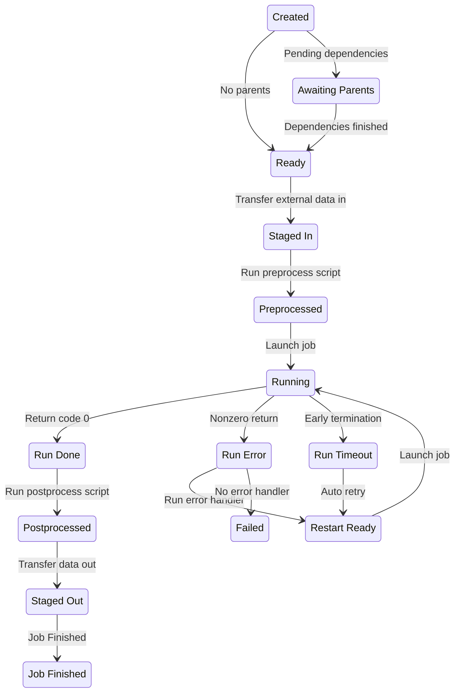

# Balsam Jobs

## Key Concept: The Job Lifecycle

The Balsam `Job` represents a single invocation of [an `App`](./appdef.md) on
some specified computing resources. Each `Job` is a stateful object that
advances through a lifecycle of **states** (from `CREATED` to `JOB_FINISHED` in
a successful flow).  

After [defining the requisite `Apps`](./appdef.md#writing-applicationdefinitions), we create a collection
of `Jobs`. Each Job specifies any data transfer or inter-job
dependencies. The collection of `Jobs` represents our workflow, which is then
executed by Balsam over time.

!!! note "Jobs do not automatically run!"
    As mentioned in the
    [quickstart](../tutorials/theta-quickstart.md#queueing-a-batchjob),
    Jobs only specify the CPU/GPU resources needed for each task.  In
    order to **run** Jobs, we then request a block of node-hours
    by [submitting a BatchJob](./batchjob.md).  This section goes into
    detail on managing `Jobs`, which is a separate concern in Balsam.
    You will find your jobs waiting in the `PREPROCESSED` state until
    a `BatchJob` begins running.


In the normal (successful) flow of execution, a `Job` moves through the
following sequence of states.  The table below defines each state as well as the 
action performed by Balsam to move the job toward the next state.

| State              | Meaning                                     | Next Balsam Action                                     |
| ------------------ | ------------------------------------------- | -----------------------------------------------        |
| `CREATED`          | Job initially submitted.                    | Check the parent Job and data transfer dependencies    |
| `AWAITING_PARENTS` | Pending parent job dependencies.            | Advance to `READY` when all parents finished           |
| `READY`            | All parent jobs have finished.              | Submit any stage-in transfer tasks                     |
| `STAGED_IN`        | All data dependencies staged in.            | Call the [`preprocess()` hook][preproc]                |
| `PREPROCESSED`     | The `preprocess` hook completed.            | Acquire and launch the executable on a compute node    |
| `RUNNING`          | Started executing on a compute node.        | Poll the executing Job process's return code           |
| `RUN_DONE`         | Execution finished with return `0`.         | Call the [`postprocess()` hook][pstproc]               |
| `POSTPROCESSED`    | The `postprocess` hook completed.           | Submit any stage-out transfer tasks                    |
| `STAGED_OUT`       | All stage-out transfers completed.          | Mark the job `JOB_FINISHED`                            |
| `JOB_FINISHED`     | The job has completed processing.           | **Nothing (end state)**                                |

Additionally, Balsam defines the following exceptional states for handling jobs
that encounter errors or early termination:

| State              | Meaning                                     | Next Balsam Action                                     |
| ------------------ | ------------------------------------------- | -----------------------------------------------        |
| `RUN_ERROR`        | Execution finished with nonzero returncode. | Call the [`handle_error()` hook][errorhn]              |
| `RUN_TIMEOUT`      | Execution was terminated mid-run.           | Call the [`handle_timeout()` hook][tmouthn]            |
| `RESTART_READY`    | Job is ready to run again.                  | Acquire and launch the executable on a compute node    |
| `FAILED`           | Completed processing (unsuccessfully).      | **Nothing (end state)**                                |

Hopefully, it's clear from these state flows that a `Job` can be thought of as
the workflow surrounding a **single App run**. You should check out [specific
examples of the Balsam hooks](./appdef.md#job-lifecycle-hooks) that can be used
to build interesting workflows at the `ApplicationDefinition` level. If we don't
define any special hooks or data transfers, most of the steps listed above are
*no-ops* and the `Job` simplifies down to a simple run of an App command.

Of course, we can also build DAGs or ensembles of *many* application runs by
creating multiple `Jobs`,  potentially specifying inter-`Job` dependencies.  We
will show effective methods for creating large batches of Jobs later on.  To
conclude this section, the **state diagram** below summarizes the Job lifecycle
by illustrating the common state flows.

[preproc]: ./appdef.md#the-preprocess-hook
[pstproc]: ./appdef.md#the-postprocess-hook
[errorhn]: ./appdef.md#error-handler
[tmouthn]: ./appdef.md#timeout-handler




## Creating Jobs

To create a `Job`, we need to supply arguments via the Python API's `Job()` constructor
*or* the `balsam job create` CLI.  Most fields are optional and take sensible default values.
At a minimum, we must always supply:
  
- `app_id` *or* `app_name` and `site_path`: reference to the specific `App`
- `workdir`: the working directory, *relative* to the Site's `data/` path
- Any `parameters` required by the `ApplicationDefinition`'s command template
- Any `transfers`  items required by the `ApplicationDefinition`

We can also create `Jobs` [using the `ApplicationDefinition.submit()` shorthand](./appdef.md#the-submit-shortcut): this removes the need for `app_id` because the value is inferred from the application class itself.
### CLI Job Creation

The [quickstart tutorial](../tutorials/theta-quickstart.md#submitting-jobs-from-the-command-line) showed an example of CLI job creation:

```bash
$ balsam job create --site=laptop --app Hello --workdir demo/hello2 --param say_hello_to="world2" 
```

If `-a/--app` doesn't uniquely specify an App by its [class
path](./appdef.md#the-class-path), you can provide the numeric app ID (revealed
by `balsam app ls`) or target a specific site [using the `--site`
selector](./cli.md).  **Since you can target any App defined at any Site, the
process of submitting Jobs locally or between systems
is seamless and unified.**

By passing `test/1` to the `-w/--workdir` option, we declare that the job should
run in the `data/test/1/` subdirectory of the Site.  This folder will be created
automatically.

Finally, multiple command template parameters can be passed by repeated
`-p/--param` arguments.  In the example above we have only one parameter called
`name` and provide a value of `"world"`.

!!! note "Multiple Arguments"
    Run `balsam job create --help` to list the various options and example
    usage.  For any option that takes multiple arguments, they should be provided by repeating the flag. For instance, `balsam job create --tag foo=xyz --tag experiment=initial` will create a job with two tags.

### API Job Creation

You will usually prefer to leverage the flexibility of Python to populate a
large number of `Jobs` programmatically. For example, a common pattern in Balsam
is to write a quick one-off script to crawl a directory of input files and
generate a Job for each one.  Our entrypoint to creating `Jobs` from Python is the Balsam `Job` API:

```python
from balsam.api import Job
```

!!! note "Take advantage of the docstrings and type annotations!"
    We strongly recommend using the Balsam APIs in an interactive development
    environment such as a Jupyter Notebook or Python IDE of choice.  Each Balsam
    model defined under `balsam.api` includes detailed docstrings and type
    annotations for the possible methods.

We can construct an in-memory `Job` object by populating the required fields, and then we submit it to the web service by calling `job.save()`.
This is the Python equivalent of the previous CLI example:

```python
job = Job(app_id=123, workdir="test/1", parameters={"name": "world!"})
job.save()
```

If you don't want to lookup and hard-code the `app_id`, you can provide the app name in its place.  If you're using the same app name at multiple Sites, you will also have to provide the `site_name` to disambiguate which app you really mean to create:

```python
job = Job(
    app_id="Hello",
    site_name="theta-gpu",
    workdir="test/1",
    parameters={"name": "world!"}
)
job.save()
```

A shortcut for creating and saving the `Job` in one step is provide the same exact arguments to `Job.objects.create`:

```python
job = Job.objects.create(app_id=123, ...)
# don't need to call job.save()
```

The **real** advantage of the API is to create many related `Jobs` programmatically.  We can still call `job.save()` one-by-one, but it's more
efficient to *bulk-create* the jobs with a single network round trip:

```python
jobs = [
    Job(app_id=123, workdir=f"test/{n}", parameters={"name": f"world {n}!"})
    for n in range(10)
]

# Capture `jobs` as return value!
jobs = Job.objects.bulk_create(jobs)
```

!!! warning "`bulk_create` does not modify objects in place!"
    When passing a list of Jobs into `bulk_create()`, you **must** use the returned value to overwrite the input list with the newly-created Jobs.  This is necessary to set the ID on each item as generated by the server.  Otherwise, the created Jobs will have `id == None` and generally behave like objects that have never been saved to the API.

Finally, `ApplicationDefinitions` provide a convenient shorthand to create `Jobs` from the same file that the application is defined in:

```python
job = Hello.submit(workdir="test/123", name="world!")
```

When using the `ApplicationDefinition.submit()` syntax, the `app_id` is automatically inferred, and any unrecognized keyword arguments are passed through into `job.parameters`.
This allows for a very concise Job creation. To use `submit` with bulk-creation, pass `save=False` to avoid saving each `Job` to the API one a time: 

```python
jobs = [
    Hello.submit(workdir=f"test/{n}", say_hello_to=f"world {n}!", save=False)
    for n in range(10)
]
jobs = Job.objects.bulk_create(jobs) # efficient creation
```

### Tagging Jobs

When creating many `Jobs` to run the same `App`, we need a way of keeping things
organized and searchable.  Jobs should be organized into hierarchical working
directories in a scheme that makes sense for your workflow.  Jobs can then be
*queried* by working directory substrings, which facilitates monitoring groups
*of Jobs
having some common path fragment.

However, organizing by `workdir` quickly becomes limited, so Balsam provides a
more flexible system for **tagging** `Jobs` with arbitrary key-value string
pairs.  You can assign `Jobs` any tag names and values (keeping in mind that
even numerical tags are treated as strings), and then easily query or manipulate
Jobs according to their tags.

```bash
# Create tagged jobs...
$ balsam job create --tag experiment=foo --tag system=H2O --tag run=5 # ...other args

# ...so that you can fetch jobs with certain tags later!
$ balsam job ls --tag experiment=foo
```

The idea is much the same with the Python API:

```python
Job.objects.create(
    # ...other kwargs here
    tags={"experiment": "foo", "system": "H2O", "run": "5"}
)
for job in Job.objects.filter(tags={"experiment": "foo"}):
    if job.state == "JOB_FINISHED":
        print("Finished:", job.workdir)
```

### Associating Data with Jobs

The Balsam service is not designed to store large volumes of data directly;
instead, Balsam interfaces with external transfer providers such as
[Globus](https://www.globus.org/) to orchestrate out-of-band data transfers
efficiently.  Nevertheless, each Balsam `Job` contains a `data` attribute that
can store a dictionary of arbitrary, JSON-serialized data.  This can be
particularly useful to attach some user-defined, persistent state to `Jobs` that
can be [leveraged by the lifecycle hooks](./appdef.md#job-lifecycle-hooks).

```python
# Creating Jobs with some initial data
Job.objects.create(
    # ...other kwargs here
    data={"retry_count": 0, "input_coords": coords}
)
```

Note that in order to *update* `job.data` on an existing Job, we need to assign a new dictionary to the `job.data` attribute, rather than setting an individual key:

```python
job = Job.objects.get(tags={"experiment": "foo"}, workdir__contains="foo/20")
dat = job.data
retry_count = dat["retry_count"] + 1

# Merge the old job.data with an incremented value:
job.data = {**dat, "retry_count": retry_count + 1}
job.save()
```

This is a consequence of the descriptor protocol used to track mutations to 
`Job` fields. The Python API currently sends only fields which have been
expclitly set (`job.FIELD = VALUE`) in updates to the backend. If you modify an existing mutable field (appending to a list or setting a new key on the `data` dictionary), the change cannot yet be detected by the Balsam client API layer.

### Defining Compute Resources

The default `Job` arguments assume the application will execute as one
single-threaded process occupying a full compute node.  This is often not the
case, and the `Job` constructor provides several options to specify precise
resource requirements. As usual, these parameters can be specified via the
Python API or CLI when creating new Jobs.  

- `num_nodes`: number of compute nodes needed in a multi-node MPI application
- `ranks_per_node`: number of processes (MPI ranks) per compute node
- `threads_per_rank`: number of threads per rank
- `threads_per_core`: number of threads per physical CPU core
- `launch_params`: optional pass-through parameters to MPI launcher
- `gpus_per_rank`: number of GPU accelerators per rank
- `node_packing_count`: maximum number of `Jobs` that may run simultaneously on the same compute node
- `wall_time_min`: optional Job execution time estimate, in minutes

Balsam dynamically schedules `Jobs` onto the available compute resources over
the course of each launcher (pilot batch job). Each `Job` is considered to fully
occupy a whole number of CPU cores and GPU devices while it runs.  For each compute node in a batch allocation, Balsam tracks the list of busy CPUs, busy GPUs, and a **node occupancy** metric.  The occupancy is a floating-point value between 0.0 (idle) and 1.0 (busy) calculated as the *sum* of `1 / job.node_packing_count` over all `jobs` running on a node. When Balsam places a sub-node job, it simultaneously honors the constraints:

- The node must have enough idle GPUs (`job.ranks_per_node * job.gpus_per_rank`)
- The node must have enough idle CPUs (`job.ranks_per_node * job.threads_per_rank // job.threads_per_core`)
- The node must have low enough occupancy to accommodate the `job` without exceeding an occupancy of 1.0.

!!! note "Job Placement Examples"
    Consider a 2-node allocation on a system with 64 CPU cores and 8 GPUs per
    node.  
    
    - If there are 16 single-process `jobs` with `node_packing_count=8` and
    `gpus_per_rank=1`, then all 16 runs will execute concurrently.  
    - With `node_packing_count=4` and `gpus_per_rank=1`, only 8 jobs will run at a time (4
    per node, constrained by the node occupancy).
    - If `node_packing_count=8` and `gpus_per_rank=8`, only 2 jobs
    will run at a time (one job per node, constrained by the lack of idle GPUs).

### Parent Job Dependencies

By including parent Job IDs in a `Job` constructor, we create *dependencies*:
every `Job` waits to begin executing until all of its parents reach the
`JOB_FINISHED` state. This can be used to build workflows comprising several
`Apps`. Moreover, since `Jobs` can be created in lifecycle hooks, we can
leverage this ability to dynamically change the workflow graph as Jobs are
executed.

```python
# Create a Job that depends on job1 and job2:
Job.objects.create(
    # ...other kwargs
    parent_ids=[job1.id, job2.id]
)
```

### Data Transfer

In the [App Transfer Slots section](./appdef.md#transfer-slots), we explained
how `ApplicationDefinition` classes define requirements for remote data
stage in before execution (or stage out after execution).  This scheme has
two advantages:

- The inputs and outputs for an `App` are explicitly defined and consistently named
  alongside the other ingredients of the `ApplicationDefinition` class. This pattern
  facilitates writing command templates and lifecycle hooks that are decoupled from
  details like external file paths.
- The Balsam Site Agent automatically groups transfers from endpoint `A` to `B`
across many Jobs.  It can then submit *batched* transfer tasks to the underlying
transfer service provider, and those transfers are monitored until completion.
As soon as input data arrives, waiting jobs transition from `READY` to
`STAGED_IN` and begin preprocessing.  The end-to-end lifecycle (await parent
dependencies, stage in datasets, preprocess, schedule compute nodes, launch
application) is **fully managed** by the Site Agent.

Since the `ApplicationDefinition` decides how files are named in local working directories,
we only need to fill the Transfer Slots by providing
remote data locations. The Job `transfers` argument
is a dictionary of the form `{"slot_name": "location_alias:absolute_path"}`.

- `slot_name` must match one of the App's transfer keys.
- `location_alias` must match one of the keys in the
`transfer_locations` dictionary in `settings.yml`. 
- `absolute_path` is the fully-resolved path to the source file or directory for
stage-ins. For stage-outs, it is the path of the *destination* to be written.
  
!!! note "Adding Location Aliases"
    The `transfer_locations` dictionary in `settings.yml` maps location aliases
    to values of the form `protocol://network_location`.  A useful example would
    be a [Globus Connect
    Personal](https://www.globus.org/globus-connect-personal) endpoint running
    on your laptop.  The corresponding list item under `transfer_locations` in
    `settings.yml` would look like this:

    ```yaml
    transfer_locations:
        laptop: globus://9d6d99eb-6d04-11e5-ba46-22000b92c6ec
    ```

In this example, we create a `Job` that runs on a supercomputer but copies the
`input_file` from our laptop and eventually writes the `result` back to it.

```python
Job.objects.create(
    # ...other kwargs
    transfers={
        # Using 'laptop' alias defined in settings.yml
        "input_file": "laptop:/path/to/input.dat",
        "result": "laptop:/path/to/output.json",
    },
)
```

## Querying Jobs

Once many `Jobs` are added to Balsam, there are several effective ways of
searching and manipulating those jobs from the CLI or Python API. The Balsam
query API has a regular structure that's the same for all resources (`Site`,
`App`, `Job`, `BatchJob`, etc...) and loosely based on the [Django
ORM](https://docs.djangoproject.com/en/3.2/topics/db/queries/).  Refer to the
[next section on the Balsam API](./api.md) for general details that apply to
*all* resources.  In the following, we focus on `Job` specific examples, because
those are the most common and useful queries you'll be performing with
Balsam.  

!!! note "The CLI is just a wrapper of the API"
    While the examples focus on the Python API, the CLI is merely a thin
    wrapper of the API, and most CLI queries can be inferred from the `balsam job ls
    --help` menu.

    For example, this Python query:
    ```python
    Job.objects.filter(state="FAILED", tags={"experiment": "foo"})
    ```

    is equivalent to this command line:
    ```bash
    $ balsam job ls --state FAILED --tag experiment=foo
    ```

### Filtering Examples
`Job.objects` is a **Manager** class that talks to the underlying REST API over
HTTPS and builds `Job` objects from JSON data transferred over the Web.  We can
start to build a query with one or many filter kwargs passed to
Job.objects.filter().  The `filter` docstrings are again very useful here in
listing the supported query parameters within your IDE.  Queries are *chainable*
and
*lazily-evaluated*:

```python
from balsam.api import Site, Job

# This hits the network and immediately returns ONE Site object:
theta_site = Site.objects.get(name="theta", path="my-site")

# This doesn't hit the network yet:
foo_jobs = Job.objects.filter(
    site_id=theta_site.id, 
    tags={"experiment": "foo"},
)

# We chain the query and iterate, triggering HTTPS request:
failed_workdirs = [
    j.workdir 
    for j in foo_jobs.filter(state="FAILED")
]
```

We can generate a query that returns *all* Jobs across Balsam:

```python
all_jobs = Job.objects.all()
```

Queries support slicing operations:
```python
some_jobs = all_jobs[5:15]
```

We can count the number of Jobs that satisfy some query:
```python
Job.objects.filter(state="RUNNING").count()
```

We can order the Jobs according to some criterion (prefix with `-` for descending order):
```python
ten_most_recent_finished = Job.objects.filter(
    state="JOB_FINISHED"
).order_by("-last_update")[:10]
```

We can build up queries based on numerous criteria, including but not limited to:

- `workdir__contains`: path fragment
- `tags`
- `app_id`
- `state`
- `parameters`
- `id` (single or list of Job IDs)
- `parent_id` (single or list of Parent Job IDs)

The iterable queries return `Job` instances that can be inspected or modified
and updated by calling `job.save()`.  Again, refer to the docstrings or use
`help(Job)` to see a detailed listing of the Job fields.

```python
failed = Job.objects.filter(workdir__contains="production-X", state="FAILED")

for job in failed:
    if job.return_code == 1:
        job.num_nodes = 16
        job.state = "RESTART_READY"
        job.save()
```

### Resolving the Workdir
The `Job.workdir` attribute is given and stored *relative* to the Site `data/`
directory.  Sometimes it is useful to resolve an absolute path to a job's working directory:

```python
# From a given Site and Job...
site = Site.objects.get(id=123)
job = Job.objects.get(id=456)

# The workdir can be constructed with Path join operators:
abs_workdir = site.path / "data" / job.workdir

# Or with the helper method:
abs_workdir = job.resolve_workdir(site.path / "data")
```

If you are running code from *inside* a Site, you can access the current Site configuration and the resolved `data/` path:

```python
from balsam.api import site_config

abs_workdir = job.resolve_workdir(site_config.data_path)
```


### Accessing Parents
`Jobs` contain the special method `parent_query()` which returns a iterable
query over the job's parents.  For example, we can combine this with
`resolve_workdir` to list the parents' working directories.  This pattern can
be particularly useful in the preprocessing app hook, where a Job needs to read some
data from its parents before executing:

```python hl_lines="9-10"
from balsam.api import site_config
from balsam.api import ApplicationDefinition

class MyApp(ApplicationDefinition):
    # ...other class attrs

    def preprocess(self):
        parent_workdirs = [
            j.resolve_workdir(site_config.data_path)
            for j in self.job.parent_query()
        ]
```


## Updating Jobs

In addition to the examples where `Jobs` were modified and updated by calling
`save()`, we can efficiently apply the same update to *all* jobs
matching a particular query.  This can be **significantly** faster than calling
`job.save()` in a loop, which repeatedly sends small HTTP update requests over
the wire.

```python
# Run all the Failed Jobs again:
Job.objects.filter(state="FAILED").update(state="RESTART_READY")
```

## Deleting Jobs

Just as we can apply updates to individual jobs or job sets selected by a query, we can also **delete** `Jobs`:

```python
# Delete a single job:
job.delete()

# Delete a collection of Jobs:
Job.objects.filter(state="FAILED", tags={"run": "H2O"}).delete()
```

## Python App Futures

When [using the `run() function`](./appdef.md#python-applications) in your
`ApplicationDefinitions`, you can treat the resultant `Job` objects like standard Python
[Futures](https://docs.python.org/3/library/concurrent.futures.html#future-objects) in a few useful ways.

### Accessing Results
The `Job.result(timeout=None)` method will block until the job is completed, and return the propagated return value of the `run()` function.  If the function raised an Exception, the Exception is re-raised:

```python
job = Adder.submit("test/123", x=3, y=7)
assert job.result() == 3 + 7
```
`result()` optionally takes a floating point seconds timeout value.  If the Job does not complete within the timeout period, it will raise `concurrent.futures.TimeoutError`.

Similarly, `result_nowait()` will return the result in a non-blocking fashion
and raise  `Job.NoResult` if a result is not immediately available.

### Polling a single job on completion
`Job.done()` polls the API and returns `True` if the Job is either in the `JOB_FINISHED` or `FAILED` state.

### Polling many jobs on completion
The `Job.objects.wait()` function takes a list of `Jobs` and behaves otherwise analogously to [`concurrent.futures.wait`](https://docs.python.org/3/library/concurrent.futures.html#concurrent.futures.wait).  This can be used to efficiently poll on a large collection of Jobs with a timeout  and sort the results by completed/in-progress Jobs:

```python
wait_result = Job.objects.wait(
    active_jobs, 
    return_when="FIRST_COMPLETED",
    timeout=60, 
    poll_interval=10
)
print(f"{len(wait_result.done)} jobs completed")
print(f"{len(wait_result.not_done)} active jobs")
```

### Iterating over Jobs as they complete
The `Job.objects.as_completed()` function behaves analogously to
[`concurrent.futures.as_completed`](https://docs.python.org/3/library/concurrent.futures.html#concurrent.futures.as_completed).  The method returns an generator over the input `Jobs`, which yields `Jobs` one a time as they are completed.

```python
for job in Job.objects.as_completed(active_jobs, timeout=60):
    print(f"Job {job.workdir} returned:  {job.result()}")
```
