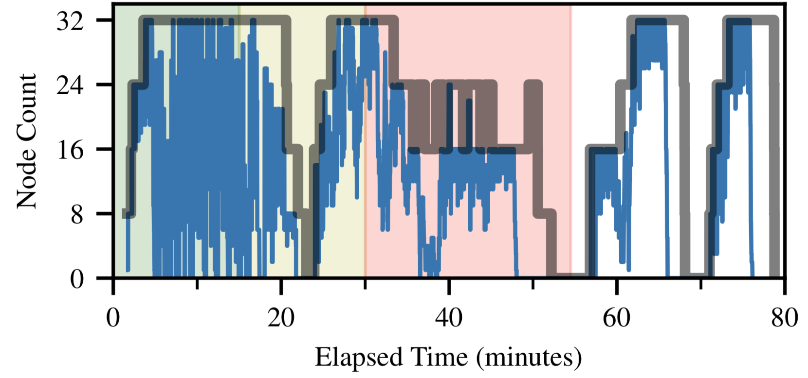

# Debugging, Monitoring, and Analytics

## Methods
There are a few levels at which we can follow the workflows running in Balsam,
diagnose errors, and gain insight into recent progress or efficiency. We can 
always use the Python API or CLI to perform flexible queries:

- [tracking Job states](./jobs.md#querying-jobs) with `balsam job ls`
- [tracking BatchJob states](./batchjob.md#using-the-cli) with `balsam queue ls`

We can also simply read the files generated at the Balsam site.  Job-level standard
output and error streams will appear in the `job.out` file of each Job's working 
directory.  We can also search the Balsam logs for informative messages (e.g.
when a Job is launched or an uncaught exception is thrown):

- reading the output of Jobs in the `data/` directory
- reading pre-/post-processing logs generated by the Balsam site agent
(`logs/service*.log`)
- reading Job execution logs generated by the Balsam launcher
  (`logs/mpi_mode*.log` or `logs/serial_mode*.log` for the respective job modes)


Finally, Balsam provides an `EventLog` API that we can use to flexibly query Job
events (state transitions) and visualize metrics like throughput or utilization
within a particular subset of Jobs or BatchJobs:

- querying recent events with `EventLog`
- generating visual reports using `balsam.analytics`

## The EventLog API

The timestamp of each Job state transition (e.g. `PREPROCESSED` --> `RUNNING`) is
recorded in the Balsam `EventLog` API.  We can leverage [standard Balsam API
queries](./api.md#querying) to obtain a relevant set of Events to answer many
interesting questions.

Here, we print all the event details for each Job tagged with  `experiment="foo"`:
```python
from balsam.api import EventLog

for evt in EventLog.objects.filter(tags={"experiment": "foo"}):
    print(evt.job_id)      # Job ID
    print(evt.timestamp)   # Time of state change (UTC)
    print(evt.from_state)  # From which state the job transitioned
    print(evt.to_state)    # To which state
    print(evt.data)        # optional payload
```

### Example Queries

Refer to the `EventLog.objects.filter` docstrings for a comprehensive listing of
the possible query parameters.  Here, we list just a few of the most useful queries.

Get all `EventLogs` for a particular set of Job IDs:
```python
EventLog.objects.filter(job_id=[123, 124, 125])
```

Get `EventLogs` for all the Jobs that ran in a particular `BatchJob`:

```python
EventLog.objects.filter(batch_job_id=123) # Using Balsam's intrinsic BatchJob ID (revealed by balsam queue ls --history)
EventLog.objects.filter(scheduler_id=456) # Using the HPC scheduler's own ID (e.g. Cobalt ID)
```

Get `EventLogs` for all the Jobs having a set of matching tags:
```python
EventLog.objects.filter(tags={"experiment": "ffn-1", "scale_nodes": "512"}) 
```

Get `EventLogs` for a particular state transition:
```python
EventLog.objects.filter(to_state="RUNNING") # all Job startup events
EventLog.objects.filter(from_state="RESTART_READY", to_state="RUNNING") # Only *restart* Events
```

Get `EventLogs` that occured within a certain UTC time range:
```python
from datetime import datetime, timedelta

yesterday = datetime.utcnow() - timedelta(days=1)
EventLog.objects.filter(timestamp_after=yesterday) # Only events more recent than 1 day
```

## The Analytics API

We can certainly process the `EventLog` queries above however we want (e.g. to
count how many Jobs started in a certain experiment or a certain time interval).
However, the `balsam.analytics` provides convenience methods for the most common
Balsam Event processing tasks.

In particular, we can use this module to visualize:

- **Throughput:**  the finished Job count as a function of time
- **Utilization:** how many Jobs were *running* as a function of time
- **Node availability:** how many *compute nodes* were actively running a Balsam launcher as a function of time

To perform these analyses, we simply call one of the following methods to generate time-series data:

- `throughput_report(eventlog_query, to_state="JOB_FINISHED")`
- `utilization_report(eventlog_query, node_weighting=True)`
- `available_nodes(batchjob_query)`

Each of these methods returns a 2-tuple of `(X, Y)` data that fits seamlessly
within a `matplotlib` visualization workflow.  We show some specific examples
below.

### Throughput
In this example, we visualize the Job throughput versus elapsed minutes in one particular launcher run:

```python hl_lines="2 7"
from balsam.api import EventLog
from balsam.analytics import throughput_report
from matplotlib import pyplot as plt

events = EventLog.objects.filter(scheduler_id=123)

times, done_counts = throughput_report(events, to_state="RUN_DONE")

t0 = min(times)
elapsed_minutes = [(t - t0).total_seconds() / 60 for t in times]
plt.step(elapsed_minutes, done_counts, where="post")
```

### Utilization
We can look at how many nodes were *actively* running a Job at any given time
using the same `EventLog` query from above. In this example, keeping the default
`node_weighting=True` kwarg ensures that each Job is weighted by its resource
requirements (so that 8 simultaneous jobs with `node_packing_count=8` contribute
`8/8=1.0` to the overall utilization):

```python hl_lines="2 7"
from balsam.api import EventLog
from balsam.analytics import utilization_report
from matplotlib import pyplot as plt

events = EventLog.objects.filter(scheduler_id=123)

times, util = utilization_report(events, node_weighting=True)

t0 = min(times)
elapsed_minutes = [(t - t0).total_seconds() / 60 for t in times]
plt.step(elapsed_minutes, util, where="post")
```

### Available Nodes

It's often most interesting to super-impose the utilization with the total
number of available compute nodes.  For *one* `BatchJob` this is really easy: we
just plot a horizontal line at the node count. If we are using auto scaling or
have several BatchJob allocations overlapping in time, the available node count becomes a more
complex step function in time.  We can generate this from a BatchJob query in Balsam:


```python hl_lines="2 7"
from balsam.api import BatchJob
from balsam.analytics import available_nodes

foo_batchjobs = BatchJob.objects.filter(
    filter_tags={"experiment": "foo"}
)
times, node_counts = available_nodes(foo_batchjobs)
```

By overlaying this timeline with the Job utilization from above, we get an
intuitive visual representation of how efficiently Balsam is using the available
resources.  An example is shown below, where the thick, gray trace shows the
`available_nodes`, while the thin blue trace shows the `utilization_report`. 

{ style="width: 80%; display: block; margin: 0 auto" }