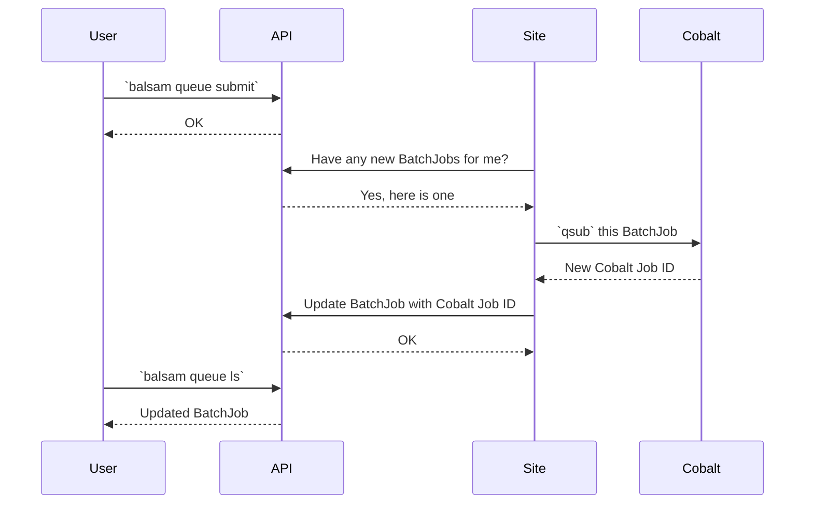

# Balsam Sites

## Sites have a single owner
All Balsam workflows are namespaced under **Sites**, which are self-contained
project directories managed by an autonomous user agent. There is no concept of
sharing Balsam Sites with other users: **each Site has exactly one owner**, who is
the sole user able to see the Site. Therefore, to create a
new Site, you must be authenticated with Balsam:

```bash
$ balsam login
```

## Creating a site

To initialize a Balsam site, we use the CLI to select an appropriate **default configuration**
for the current system.  Balsam creates a new Site directory and registers it with the REST API.

```bash
$ balsam site init SITE-PATH
```

The Site is populated with several folders and a bootstrapped configuration file `settings.yml`.


## The Site directory

Each Balsam site has a regular structure comprising certain files and directories:

- `apps/`:  This directory contains Python modules with `ApplicationDefinition` classes defining
  the known applications in each Site.  You can freely extend the examples and create Jobs
  to invoke these Apps.
- `data/`:  Each Balsam Job runs in a subdirectory of `data/`.   The Job working directories
  are specified *relative* to this folder via `job.workdir`.
- `log/`:   The Site user agent and launcher pilot jobs send diagnostic messages
here. Checking the logs is a great way to track exactly what is happening or
what went wrong.
- `qsubmit/`:  Balsam runs your apps inside of *launchers* which are
submitted to the HPC batch scheduler via a shell script.  This directory
contains each of the materialized scripts that was actually submitted to the batch queue.
- `job-template.sh`:  This is the template for the  `qsubmit/` 
scripts submitted to the HPC batch scheduler.
- `settings.yml`:  This is where the majority of Balsam Site behavior is configured.  The file is populated with sensible defaults and heavily commented for you to read and modify.


## Customizing the Job Template
You can adapt the `job-template.sh` file to add custom scheduler flags, or to
run code on your allocation before the pilot job starts.  Some examples of job
template customization include:

  - Adding scheduler-specific directives to the header of the shell script
  - Configuring hardware (e.g. setting up MIG mode on GPUs)
  - Staging data by copying files to node-local SSD's
  - Loading modules or exporting global environment variables

Feel free to add logic to the `job-template.sh` file as needed.  You can also maintain templates with
different filenames, and point to the currently active job template by changing the `job_template_path` parameter in `settings.yml`.

!!! note "Keep Template Variables Intact"
    Any values enclosed in double-curly braces (`{{launcher_cmd}}`) are
    variables provided to the template from Balsam.  Be sure to leave these
    names intact when modifying the template!

Whenever you change the job template or Site settings file, it is necessary to 
reload the Site if it's already running:

```bash
$ balsam site sync
```

!!! warning
    The `job-template.sh` and `settings.yml` are first loaded when the Site starts and stay in memory!  Therefore, any changes will **not** apply until you stop and restart the Site, using `balsam site stop` and `balsam site start` or `balsam site sync`.

### Optional Template Variables
Because templates are generated with [Jinja2](https://jinja.palletsprojects.com/en/3.0.x/), you
can write custom templates leveraging variables, if-statements, for-loops,
etc... referring to the Jinja2 template syntax.  You can define **optional
parameters** exposed to the template by using the `optional_batch_job_params` key
of `settings.yml`. This expects a dictionary mapping parameter **names** to **default string values**. 

These "pass-through" parameters can then be provided as
extras on the command line via `-x/--extra-param` flags.
For instance, the ALCF-Theta job template supports a `singularity_prime_cache` option that allows you to enable this
feature using `-x singularity_prime_cache=yes` on the `balsam queue submit`
command.  Here's how that option is implemented:

```yaml
# In settings.yml
scheduler:
  optional_batch_job_params:
      singularity_prime_cache: 'no'
```

```bash
# In job-template.sh

  # Prime LDAP for large-scale Singularity runs
  aprun -N 1 -n $COBALT_JOBSIZE /soft/tools/prime-cache
  sleep 10

```

## Customizing the Settings

There are numerous adjustable parameters in `settings.yml` that control how the
Site runs and processes your workflows.  The default values are designed to work
on the chosen platform *as-is*, but users are encouraged to read the comments
and modify `settings.yml` to suit their own needs.  

!!! note
    Be sure to run `balsam site sync` to apply any changes to the Site agent!

We highlight just a few of the important settings you may want to adjust:

  - `logging.level`: Change the verbosity to get more or less diagnostics from Balsam  in your `log/` directory.
  - `launcher.idle_ttl_sec`:  controls how long the pilot job should stay alive before quitting when nothing is running.  You might turn this up if you are debugging and want to *hold on* to resources.
  - `scheduler.allowed_projects`: lists the projects/allocations that the Site may submit to.  You need to update this to manage what allocations the Site may use.
  - `scheduler.allowed_queues`: defines the queueing policies per-queue name.  If a special reservation or partition is created for your project or a workshop,  you will need to define that here.
  - `processing.num_workers`: controls the number of simultaneous processes handling your Jobs' pre/post-processing workload.  If I/O-intensive preprocessing is a bottleneck, you can turn this value up.
  - `transfers.transfer_locations`: lets Balsam know about remote Globus endpoints
    that the Site may stage data in/out from
  - `elastic_queue`: controls automated queue submissions by defining the granularity and flexibility of resource requests.  This is disabled by default and must be configured on an as-needed basis (see the [Auto Scaling](./elastic.md) page for more information).

## The Site CLI

### Starting, Stopping, and Restarting Sites

In order for workflows to actually run at a Site, the agent must
be started as a background process on a login (or gateway) node.

```bash
# To start and stop the Site agent:
$ balsam site start
$ balsam site stop

# Restart the Site agent and push settings changes to the API:
$ balsam site sync
```

!!! note "Site Agent Resources"
    The Balsam site agent runs as persistent daemon.  It can be started
    on any node with Internet access, access to the parallel filesystems, and access to the HPC resource manager.  This is typically a "login" or "gateway" node in a multi-user environment.

The site agent runs a collection of plug-in modules responsible for various
facets of the workflow.  These plug-ins can be configured, enabled, and disabled in the `settings.yml` file by adjusting data under these keys:

- `scheduler`: interfaces with the HPC resource manager to submit and query batch resource allocations
- `processing`: runs pre- and post- job execution lifecycle hooks to advance the workflow.
- `transfers`: manages batch transfer tasks for stage in and stage out of job data
- `elastic_queue`: automates batch job submissions to auto-scale resources to the runnable backlog
- `file_cleaner`: clears unused data from working directories of finished jobs

!!! note "Launchers will still run if the agent is stopped"
    Once submitted to the HPC queue, the Balsam launchers (pilot jobs) operate
    on the compute nodes *independently* of the Site agent.  As long as they
    have a valid access token, they will work regardless of whether the Site
    is running.  However, you typically want the Site to continue running so
    that new Jobs can be preprocessed for execution.

### Listing Sites

The CLI is useful to get a quick listing of all the Sites you own:
```bash
# Summary of Sites:
$ balsam site ls
```

The `Active` column indicates whether Sites have recently communicated with the
API and are most likely up and running.  You can obtain much more detailed Site information (such as a listing of currently idle backfill windows at each Site) by
including the `-v/--verbose` flag:

```bash
# Detailed Site data:
$ balsam site ls -v
```

### Moving or Deleting Sites

To **permanently** delete a Site and all associated workflows inside:

```bash
$ balsam site rm SITE-PATH
```

To **rename** a site or move it to a new directory:

```bash
$ balsam site mv SITE-PATH DESTINATION
```

## Why is there a delay in queue submission?
Any Balsam CLI or Python API interaction (like running `balsam queue submit`),
does not affect the HPC system directly. In fact, you're only manipulating resources in the REST API (creating a `BatchJob`). Eventually, the Site agent that runs in
the background
fetches state from the backend and performs local actions (run `sbatch` or `qsub`) to synchronize your Site with the central state.  

This decoupled design, with all control flow routed through the central REST
API, makes Balsam interactions completely uniform, whether you're running
commands locally or remotely. For instance, you can provision resources on a
remote supercomputer simply by specifying the `--site` on the command line:

```bash
$ balsam queue submit --site=my-site -n 1 -t 15 -q debug -A Project -j mpi
```

