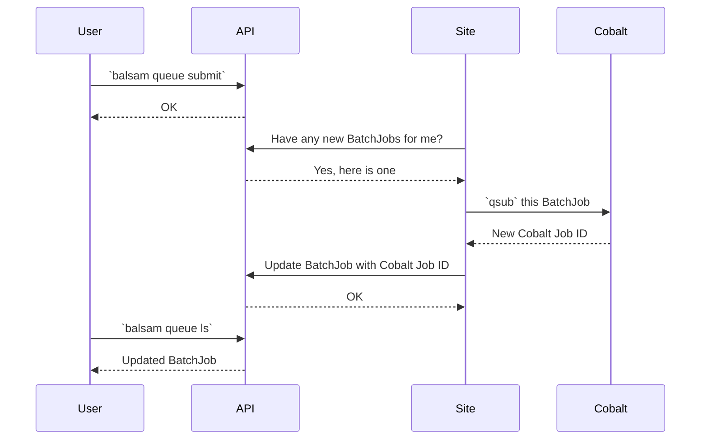

# Site Configuration

Any Balsam CLI or API interaction that you perform, other than the ones that bootstrap
a new Site, does not affect the HPC system directly.  Instead, a daemon running on your
behalf at the Balsam Site **pulls** state changes from the API and applies that state within
the local Site environment.

The Site runs an agent on your behalf.  The agent runs
persistently in the background, using
your access token to sync with the
Balsam backend and orchestrate workflows locally. This orchestration is divided among
several Site modules such as the `SchedulerPlugin`, `TransferPlugin`, and `ElasticQueuePlugin`. 

For instance, commands like `balsam queue submit` will not actually do
anything with the queue if the Site is not running: they just update the
central API. To start the Site:

## The API Client configuration

The `balsam login` command updates API client configuration data in the
`~/.balsam/client.yml` file. This file contains a reference to a `Client` class and
the configuration needed to instantiate a Client.
All components of Balsam using the API then read from the client settings file upon
initialization.

## The Site configuration

The behavior of each Balsam Site is largely controlled by the `settings.yml` file located in the
Site directory. Upon initializing a new Site with the `balsam site init` command, a user is prompted
to select from one of the pre-packaged default configurations.  Suitable example files are then
copied into the `settings.yml` and `batchjob.tmpl` files. Additionally, pre-configured Balsam application
modules are copied into the `apps/` subdirectory.

Several fields in the Site configuration file or Job Template are sync'ed with the `Site` API:

  - `allowed_projects` lets the API know about projects that the Site may submit to
  - `allowed_queues` lets the API know about the local queue policy
  - `transfer_locations` lets the API know about remote Globus endpoints
    or scp addresses that the Site is willing to stage data in/out from
  - `globus_endpoint_id` sets a local Globus endpoint ID for the Site
  - `optional_batch_job_params` lets the API know about "pass-through" parameters that the Job template
     will accept in submitting a BatchJob

## Local configuration

A Balsam Site is initialized with `balsam init`.

Site settings for each launcher Job mode dictate whether multi-apps-per-node is supported and what is the max occupancy per node.

## Global configuration
