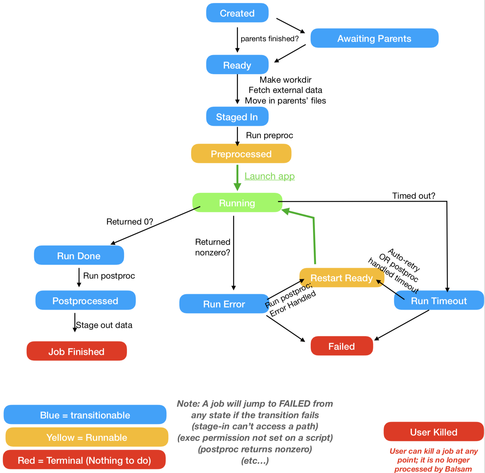

.. _ApplicationDefinition:

Setting up Applications
=========================

.. _BalsamJob:

Creating Runs with BalsamJob
==============================
Once your Applications are defined, you can start composing workflows by
adding tasks to the database. Tasks can be added with the :bash:`balsam job`
command-line tool:

.. highlight:: bash
.. code-block:: bash

    $ balsam job --help # see help menu with listing of fields
    $ balsam job --name hello --workflow Test --args "world!" --ranks-per-node 2

 or, equivalently, using the :bash:`balsam.launcher.dag.BalsamJob()` constructor and
 Django model save method:

.. highlight:: python
.. code-block:: python

    from balsam.launcher.dag import BalsamJob
    job = BalsamJob(
        name = "hello",
        workflow = "hello",
        args = "world!",
        ranks_per_node = 2,
    )
    job.save()

One of the powerful concepts in Balsam is that you can add jobs any time, from anywhere:
    - In a terminal on a login node
    - From inside a pre- or post-processing stage of a task
    - During the execution of an Application itself (either a system call to "balsam job" 
      or direct use of Python API)

Jobs can be modified and removed from the command line (see :ref:`BalsamCLI`) or Python API, as well.
The key to using the Python API is realizing that BalsamJob is a Django model,
and you inherit the rich capabilities of Django for querying and manipulating
the BalsamJob table this way. See :ref:`FAQ-Querying` for some neat
examples and link to further reading.

Balsam State Flow
-----------------
As the Balsam components process your workflow, each task advances through a 
series of states according to the flow chart below.

    Balsam processes each task (BalsamJob) as a state-machine: tasks proceed
    from one state to the next according to this flow chart. The Balsam
    service, launchers, and transition processes invoke particular actions
    for a task (or take no action at all) depending on the state of the
    BalsamJob. For instance, to re-run a task, set its state to RESTART_READY.

